# 20 - Agent 接口

> 本次新增接口，供 AI Agent 调用，使用 `X-API-Key` 请求头认证（无需 JWT Token）。  
> API Key 通过 `/api/novel-auth/api-keys` 接口获取或生成，详见 [API Key 管理](#api-key-管理)。

---

## 目录

- [接口汇总](#接口汇总)
- [认证方式](#认证方式)
- [Agent 应用管理](#agent-应用管理) — `/api/agent/app`
- [Agent 构建与发布](#agent-构建与发布) — `/api/agent`
- [Agent 任务状态查询](#agent-任务状态查询) — `/api/agent`
- [API Key 管理](#api-key-管理) — `/api/novel-auth/api-key`
- [Open API](#open-api) — `/open/v1`


---

## 接口汇总

| # | 方法 | 路径 | 说明 | 认证方式 |
|---|------|------|------|----------|
| 1 | GET | `/api/agent/app/list` | 应用列表（支持 platform 筛选） | API Key |
| 2 | GET | `/api/agent/app/query` | 聚合查询（多条件组合） | API Key |
| 3 | GET | `/api/agent/app/detail` | 应用详情（按 appId） | API Key |
| 4 | POST | `/api/agent/app/update` | 聚合编辑（批量更新配置域） | API Key |
| 5 | POST | `/api/agent/app/create` | 创建应用（异步，返回 taskId） | API Key |
| 6 | DELETE | `/api/agent/app/delete` | 删除应用（同步，含回滚） | API Key |
| 7 | POST | `/api/agent/build` | 构建小程序（入队列，返回 taskId） | API Key |
| 8 | POST | `/api/agent/publish` | 发布小程序（入队列，返回 taskId） | API Key |
| 9 | GET | `/api/agent/publish/qrcode/{taskId}` | 获取发布二维码图片 | API Key |
| 10 | GET | `/api/agent/task/{taskId}/status` | 查询任务状态 | API Key |
| 11 | GET | `/api/agent/task/{taskId}/logs` | 查询任务日志 | API Key |
| 12 | POST | `/api/novel-auth/api-key` | 获取或生成 API Key | JWT |
| 13 | GET | `/api/novel-auth/api-key` | 查询 API Key 列表 | JWT |
| 14 | DELETE | `/api/novel-auth/api-key/{id}` | 删除 API Key | JWT |
| 15 | PATCH | `/api/novel-auth/api-key/{id}/status` | 启用/禁用 API Key | JWT |
| 16 | GET | `/open/v1/me` | 验证 API Key 是否有效，返回当前用户信息 | Bearer API Key |

---

## 认证方式

Agent 接口使用 API Key 认证，在请求头中携带：

```
X-API-Key: your_api_key_value
```

---

## Agent 应用管理

基础路径: `/api/agent/app`

### 1. 应用列表

```
GET /api/agent/app/list
```

**Query 参数**

| 参数 | 类型 | 必填 | 说明 |
|------|------|------|------|
| platform | string | 否 | 平台筛选，如 `douyin` `weixin` `kuaishou` `baidu` |

**响应示例**

```json
{
  "code": 200,
  "message": "操作成功",
  "data": [
    {
      "id": 1,
      "appid": "tt75c40379eaf96af001",
      "appName": "风行推广",
      "platform": "douyin",
      "appCode": "tt_miniapp_funnovel",
      "version": "4.3.1"
    }
  ]
}
```

**时序图**

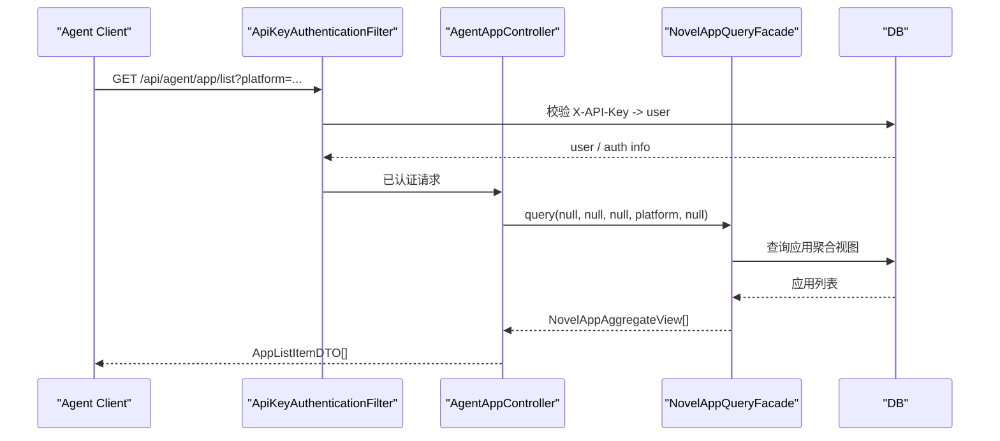

---

### 1.5. 聚合查询

```
GET /api/agent/app/query
```

支持多条件组合查询，优先级：`appId` > `appCode` > 其他条件。命中唯一结果时返回单对象，否则返回列表。

**Query 参数**（均可选）

| 参数 | 类型 | 说明 |
|------|------|------|
| appId | string | 精确匹配，优先级最高 |
| appCode | string | 精确匹配，次优先 |
| customer | string | 客户名称 |
| platform | string | 平台 |
| appName | string | 应用名称 |

**响应示例（唯一结果）**

```json
{
  "code": 200,
  "message": "查询成功",
  "data": {
    "baseConfig": { "appid": "wx123", "appName": "星辰文鉴", ... },
    "commonConfig": { ... },
    "paymentConfig": { ... },
    "uiConfig": { ... },
    "adConfig": { ... },
    "syncStatus": { "inSync": true, "lastSyncTime": "...", "description": "同步正常" },
    "permissionInfo": { "canEdit": true, "canBuild": true, "canPublish": true, "canDelete": true }
  }
}
```

**响应示例（多个结果）**

```json
{
  "code": 200,
  "message": "查询成功",
  "data": [
    { "baseConfig": { ... }, "commonConfig": { ... }, ... },
    { "baseConfig": { ... }, "commonConfig": { ... }, ... }
  ]
}
```

**错误码**

| code | errorCode | 说明 |
|------|-----------|------|
| 401 | UNAUTHORIZED | 未携带 API Key 或 Key 无效 |
| 403 | FORBIDDEN | API Key 权限不足（需要 ROLE_0/1/2/SUPER_ADMIN） |
| 500 | - | 数据库查询异常，message 为 `系统错误: ...` |

> 查询条件无匹配时**不报错**，返回空数组 `[]`。

**时序图**

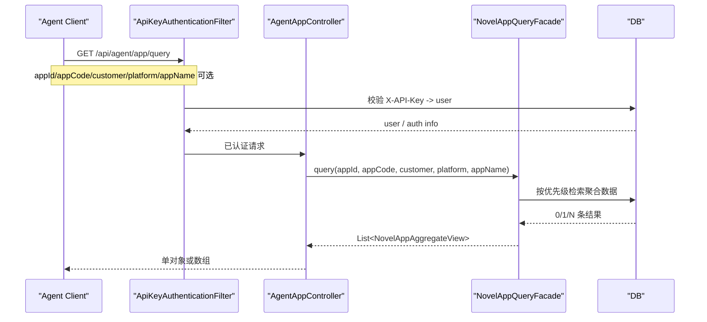

---

### 2. 应用详情

```
GET /api/agent/app/detail?appId={appId}
```

返回指定应用的完整聚合配置（baseConfig + commonConfig + paymentConfig + uiConfig + adConfig）。

**Query 参数**

| 参数 | 类型 | 必填 | 说明 |
|------|------|------|------|
| appId | string | 是 | 应用 appid |

**错误码**

| code | errorCode | 说明 |
|------|-----------|------|
| 400 | INVALID_PARAMS | appId 为空或应用不存在 |

**时序图**

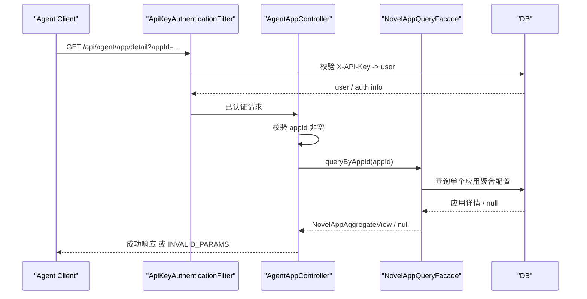

---

### 3. 聚合编辑

```
POST /api/agent/app/update
```

一次性更新应用的一个或多个配置域，**传了就改，未传（null）则不动**。

**请求体**

```json
{
  "appId": "tt75c40379eaf96af001",
  "baseConfig": {
    "version": "4.3.2"
  },
  "commonConfig": {
    "douyinAppToken": "new_token"
  },
  "uiConfig": null,
  "paymentConfig": null,
  "adConfig": null
}
```

**错误码**

| code | errorCode | 说明 |
|------|-----------|------|
| 400 | INVALID_PARAMS | appId 为空或应用不存在 |
| 409 | CREATE_IN_PROGRESS | 当前有创建任务正在进行，禁止编辑 |

**时序图**

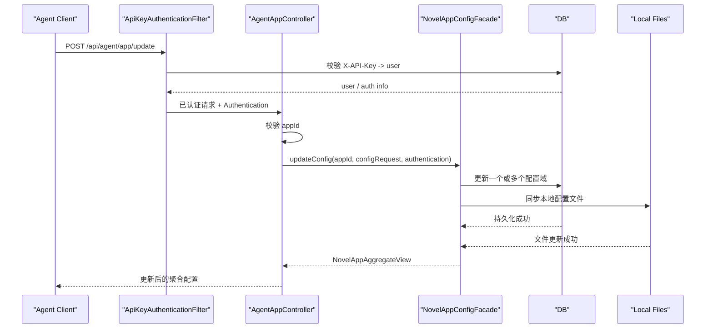

---

### 4. 创建应用

```
POST /api/agent/app/create
```

异步创建小程序，立即返回 `taskId`，通过 [任务状态查询](#agent-任务状态查询) 轮询结果。

**请求参数说明**

`baseConfig`

| 参数名 | 类型 | 是否必填 | 描述 |
|--------|------|----------|------|
| appName | string | 是 | 应用名称，如 `风行推广` |
| platform | string | 是 | 平台：`douyin` / `weixin` / `kuaishou` / `baidu` |
| appCode | string | 是 | 应用代码，格式：`{平台前缀}_miniapp_{product}` |
| appid | string | 是 | 平台分配的 AppID |
| version | string | 是 | 版本号，如 `4.3.1` |
| product | string | 是 | 产品标识，如 `funnovel` |
| customer | string | 是 | 客户标识，格式：`{平台前缀}_{product}` |
| tokenId | integer | 是 | Token ID |
| cl | string | 是 | 与 appCode 相同 |
| bannerId | string | 是 | Banner 开关 ID，格式：`{平台前缀}_mp_{product简称}_public_switch` |
| deliverId | string | 是 | 投放类型 ID，格式：`{平台前缀}_mp_{product简称}_business_type` |

`commonConfig`

| 参数名 | 类型 | 是否必填 | 描述 |
|--------|------|----------|------|
| buildCode | string | 是 | 构建代码标识，通常是产品简称，如 `funnovel` |
| contact | string | 否 | 客服链接 URL |
| douyinAppToken | string | 否 | 抖音平台 Token（douyin 平台建议填写） |
| weixinAppToken | string | 否 | 微信平台 RSA 私钥（weixin 平台建议填写） |
| kuaishouAppToken | string | 否 | 快手平台 RSA 私钥（kuaishou 平台建议填写） |
| baiduAppToken | string | 否 | 百度平台 Token（baidu 平台建议填写） |
| kuaishouClientId | string | 否 | 快手 Client ID |
| kuaishouClientSecret | string | 否 | 快手 Client Secret |
| douyinImId | string | 否 | 抖音 IM ID |
| mineLoginType | string | 否 | 个人中心登录方式，默认 `phoneLogin` |
| readerLoginType | string | 否 | 阅读器登录方式，默认 `phoneLogin` |
| iaaMode | boolean | 否 | 是否开启 IAA 模式，默认 `false` |
| iaaDialogStyle | integer | 否 | IAA 弹窗样式，默认 `2` |
| hidePayEntry | boolean | 否 | 是否隐藏付费入口，默认 `false` |
| hideScoreExchange | boolean | 否 | 是否隐藏积分兑换，默认 `true` |

`paymentConfig`（整体可选，传 `{}` 即可跳过）

| 参数名 | 类型 | 是否必填 | 描述 |
|--------|------|----------|------|
| normalPay | object | 否 | 普通支付配置 `{enabled, gatewayAndroid, gatewayIos}` |
| orderPay | object | 否 | 订单支付配置 |
| douzuanPay | object | 否 | 抖钻支付配置（douyin 专属） |
| renewPay | object | 否 | 续费支付配置 |
| wxVirtualPay | object | 否 | 微信虚拟支付配置（weixin 专属） |
| wxVirtualRenewPay | object | 否 | 微信虚拟续费支付配置（weixin 专属） |
| imPay | object | 否 | IM 支付配置 |

`adConfig`（整体可选，传 `{}` 即可跳过）

| 参数名 | 类型 | 是否必填 | 描述 |
|--------|------|----------|------|
| rewardAd | object | 否 | 激励广告配置 `{enabled, rewardAdId, rewardCount}` |
| interstitialAd | object | 否 | 插屏广告配置 `{enabled, interstitialAdId, interstitialCount}` |
| bannerAd | object | 否 | Banner 广告配置 `{enabled, bannerAdId}` |
| feedAd | object | 否 | 信息流广告配置 `{enabled, feedAdId}` |

`uiConfig`（整体可选，传 `{}` 即可跳过）

| 参数名 | 类型 | 是否必填 | 描述 |
|--------|------|----------|------|
| payCardStyle | integer | 否 | 支付卡片样式，默认 `1` |
| homeCardStyle | integer | 否 | 首页卡片样式，默认 `1` |
| mainTheme | string | 否 | 主题色，如 `#F86003` |
| secondTheme | string | 否 | 辅助色，如 `#FFEFE7` |

**请求体示例**

```json
{
  "baseConfig": {
    "appName": "风行推广",
    "appCode": "tt_miniapp_funnovel",
    "platform": "douyin",
    "version": "4.3.1",
    "product": "funnovel",
    "customer": "tt_funnovel",
    "appid": "tt75c40379eaf96af001",
    "tokenId": 13,
    "cl": "tt_miniapp_funnovel",
    "bannerId": "tt_mp_funnovel_public_switch",
    "deliverId": "tt_mp_funnovel_business_type"
  },
  "commonConfig": {
    "buildCode": "funnovel",
    "douyinAppToken": "your_token_here"
  },
  "paymentConfig": {},
  "adConfig": {},
  "uiConfig": {}
}
```

**响应示例**

```json
{
  "code": 200,
  "message": "任务已启动",
  "data": {
    "taskId": "a1b2c3d4-..."
  }
}
```

**错误码**

| code | errorCode | 阶段 | 说明 |
|------|-----------|------|------|
| 400 | INVALID_PARAMS | 同步（请求校验） | `baseConfig` 为空 |
| 400 | INVALID_PARAMS | 同步（请求校验） | `baseConfig` 必填项缺失（appName/platform/appCode/appid/version/product/customer/tokenId/cl/bannerId/deliverId） |
| 400 | INVALID_PARAMS | 同步（请求校验） | `commonConfig.buildCode` 为空 |
| 409 | DUPLICATE_APP | 同步（请求校验） | `appName + platform` 组合已存在（同名同平台） |
| 409 | CREATE_IN_PROGRESS | 同步（互斥检查） | 已有创建任务正在进行，需等待完成后重试 |
| 401 | UNAUTHORIZED | 同步（认证） | 未携带 API Key 或 Key 无效 |
| 403 | FORBIDDEN | 同步（鉴权） | 权限不足（需要 ROLE_0/1/SUPER_ADMIN） |

> 以上错误均在同步阶段返回，不会产生 taskId。

**异步阶段失败**（已返回 taskId，通过任务状态查询获取）

通过 `GET /api/agent/task/{taskId}/status` 查询，`status=FAILED` 时 `errorMessage` 为以下之一：

| errorMessage | 触发原因 |
|---|---|
| `小说应用已存在，创建失败` | 异步执行时 `appid` 已存在于数据库（极少数并发场景） |
| `图片资源文件目录不存在: .../img-sample` | 服务器上 `img-sample` 模板目录缺失 |
| `图片资源文件处理失败: {原因}` | 资源文件复制或 SVG 主题色替换失败 |
| `{文件名} 主题色替换失败: {原因}` | SVG 文件读写异常 |
| `任务线程被中断` | 服务器重启或线程被强制中断 |
| 其他 `RuntimeException` message | 本地代码文件写入失败（磁盘空间不足、路径不存在等） |

**时序图**

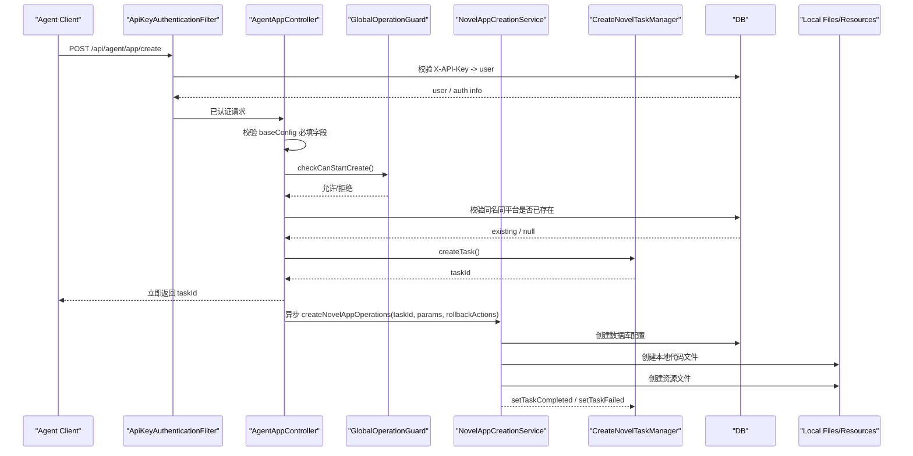

---

### 5. 删除应用

```
DELETE /api/agent/app/delete?appId={appId}
```

同步删除数据库记录、本地代码文件和资源文件，失败时自动回滚。

**Query 参数**

| 参数 | 类型 | 必填 | 说明 |
|------|------|------|------|
| appId | string | 是 | 应用 appid |

**错误码**

| code | errorCode | 说明 |
|------|-----------|------|
| 400 | INVALID_PARAMS | appId 为空或应用不存在 |

**时序图**

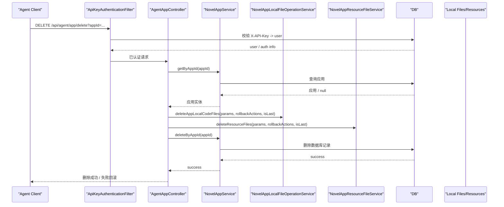

---

## Agent 构建与发布

基础路径: `/api/agent`

### 1. 构建小程序

```
POST /api/agent/build
```

将构建任务加入队列，立即返回 `taskId`。

**请求体**

```json
{
  "cmd": "npm run build:wx-xingchen"
}
```

**响应示例**

```json
{
  "code": 200,
  "message": "构建任务已加入队列",
  "data": {
    "taskId": "uuid-..."
  }
}
```

**错误码**

| code | errorCode | 说明 |
|------|-----------|------|
| 400 | INVALID_PARAMS | cmd 为空 |

**时序图**

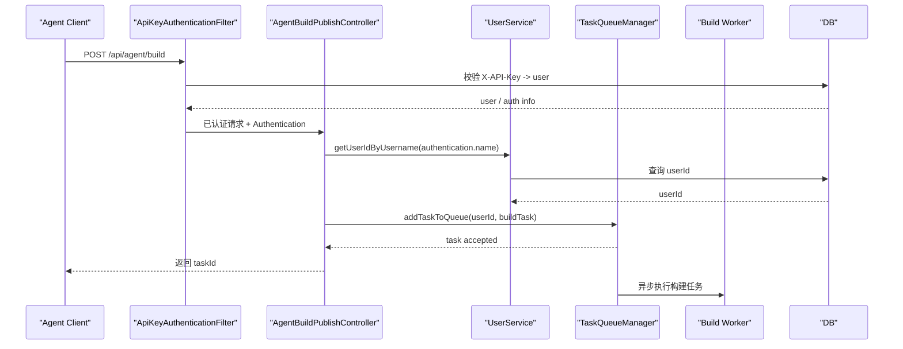

---

### 2. 发布小程序

```
POST /api/agent/publish
```

将发布任务加入队列，立即返回 `taskId`。

**请求体**

```json
{
  "platformCode": "mp-weixin",
  "appId": "wx123456",
  "projectPath": "/projects/wx123456",
  "version": "1.0.0",
  "log": "发布说明",
  "douyinAppToken": "",
  "kuaishouAppToken": "",
  "weixinAppToken": "",
  "baiduAppToken": "",
  "publishMode": ""
}
```

**必填字段**: `platformCode` `appId` `projectPath` `version` `log`  
**可选字段**: 各平台 token、`publishMode`

**错误码**

| code | errorCode | 说明 |
|------|-----------|------|
| 400 | INVALID_PARAMS | 缺少必要参数 |

**时序图**

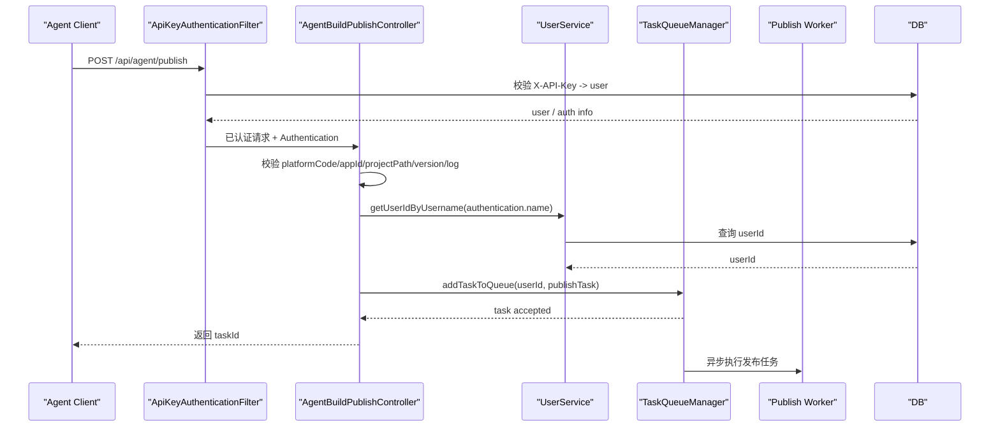

---

### 3. 获取发布二维码

```
GET /api/agent/publish/qrcode/{taskId}
```

获取指定发布任务生成的二维码图片。需在发布任务完成后调用。

**Path 参数**

| 参数 | 类型 | 说明 |
|------|------|------|
| taskId | string | 发布任务 ID |

**响应**

- 成功：返回 `image/png` 二维码图片（HTTP 200）
- 任务不存在或二维码未生成：HTTP 404
- 服务器错误：HTTP 500

**典型调用流程**

```js
// 1. 发起发布
const publishResp = await fetch('http://localhost:8081/api/agent/publish', {
  method: 'POST',
  headers: { 'Content-Type': 'application/json', 'X-API-Key': API_KEY },
  body: JSON.stringify(publishConfig),
});
const { data: { taskId } } = await publishResp.json();

// 2. 轮询任务状态
while (true) {
  await sleep(3000);
  const statusResp = await fetch(`http://localhost:8081/api/agent/task/${taskId}/status`, {
    headers: { 'X-API-Key': API_KEY },
  });
  const { data } = await statusResp.json();
  if (data.status === 'COMPLETED') break;
  if (data.status === 'FAILED') throw new Error(data.errorMessage);
}

// 3. 获取二维码
const qrResp = await fetch(`http://localhost:8081/api/agent/publish/qrcode/${taskId}`, {
  headers: { 'X-API-Key': API_KEY },
});
const qrBlob = await qrResp.blob();
```

**时序图**

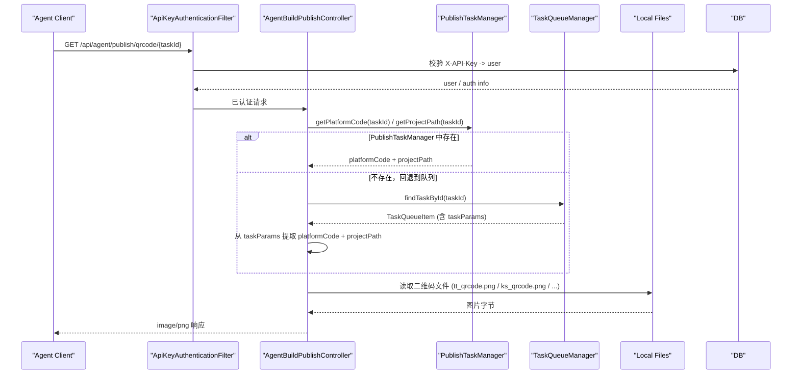

---

## Agent 任务状态查询

基础路径: `/api/agent`

### 查询任务状态

```
GET /api/agent/task/{taskId}/status
```

查询创建/构建/发布任务的当前状态。查询顺序：内存队列 → 创建任务管理器 → 数据库历史记录。

**Path 参数**

| 参数 | 类型 | 说明 |
|------|------|------|
| taskId | string | 任务 ID |

**响应示例**

```json
{
  "code": 200,
  "message": "查询成功",
  "data": {
    "taskId": "a1b2c3d4-...",
    "taskType": "CREATE",
    "status": "RUNNING",
    "description": "创建小程序任务执行中",
    "startTime": "2026-04-13T10:00:00",
    "completeTime": null,
    "errorCode": null,
    "errorMessage": null
  }
}
```

**status 枚举值**

| 值 | 说明 |
|----|------|
| PENDING | 排队等待 |
| RUNNING | 执行中 |
| COMPLETED | 已完成 |
| FAILED | 失败 |

**taskType 枚举值**: `CREATE` `BUILD` `PUBLISH`

**错误码**

| code | errorCode | 说明 |
|------|-----------|------|
| 404 | TASK_NOT_FOUND | 任务不存在 |

**时序图**

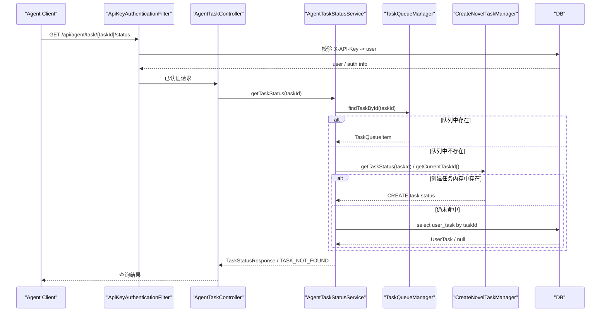

---

### 查询任务日志

```
GET /api/agent/task/{taskId}/logs
```

返回指定任务的 `user_task.log` 原文内容。

**Path 参数**

| 参数 | 类型 | 说明 |
|------|------|------|
| taskId | string | 任务 ID |

**响应示例**

```json
{
  "code": 200,
  "message": "查询成功",
  "data": "[INFO] 开始执行创建小说小程序任务...\n[INFO] 创建数据库配置...\n..."
}
```

**错误码**

| code | errorCode | 说明 |
|------|-----------|------|
| 404 | TASK_NOT_FOUND | 未找到任务 |

---

## API Key 管理

基础路径: `/api/novel-auth/api-key`

> 此模块使用 JWT Token 认证（登录后获取），用于管理 Agent 调用所需的 API Key。

### 1. 获取或生成 API Key

```
POST /api/novel-auth/api-key
```

**请求体**

```json
{
  "name": "my-agent-key"
}
```

说明：

- 当前用户已有 API Key 时直接返回
- 当前用户没有 API Key 时才创建
- 当前业务模型下每个用户只保留一把 API Key

**响应示例**

```json
{
  "code": 200,
  "message": "API Key 获取成功",
  "data": {
    "id": 1,
    "apiKey": "sk-xxxxxxxxxxxxxxxx",
    "userId": 1,
    "name": "my-agent-key",
    "enabled": 1,
    "rateLimit": 60,
    "requestCount": 0,
    "createdTime": "2026-04-13T10:00:00"
  }
}
```

**时序图**

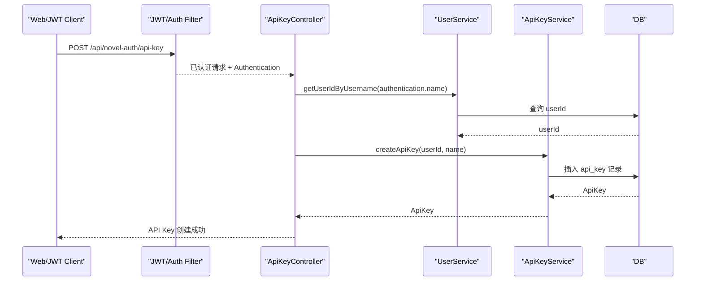

---

### 2. 查询 API Key 列表

```
GET /api/novel-auth/api-key
```

返回当前登录用户的 API Key 列表，当前模型下最多 1 条。

**时序图**

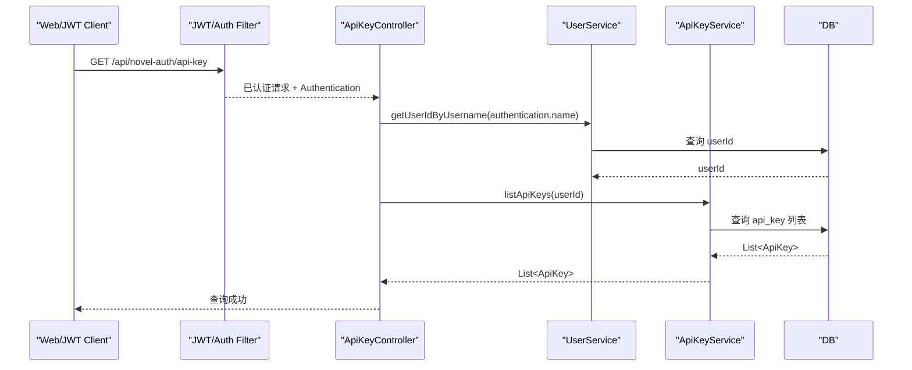

---

### 3. 删除 API Key

```
DELETE /api/novel-auth/api-key/{id}
```

**Path 参数**

| 参数 | 类型 | 说明 |
|------|------|------|
| id | long | API Key 主键 ID |

> 仅允许删除属于当前用户的 Key，否则返回 403。

**时序图**

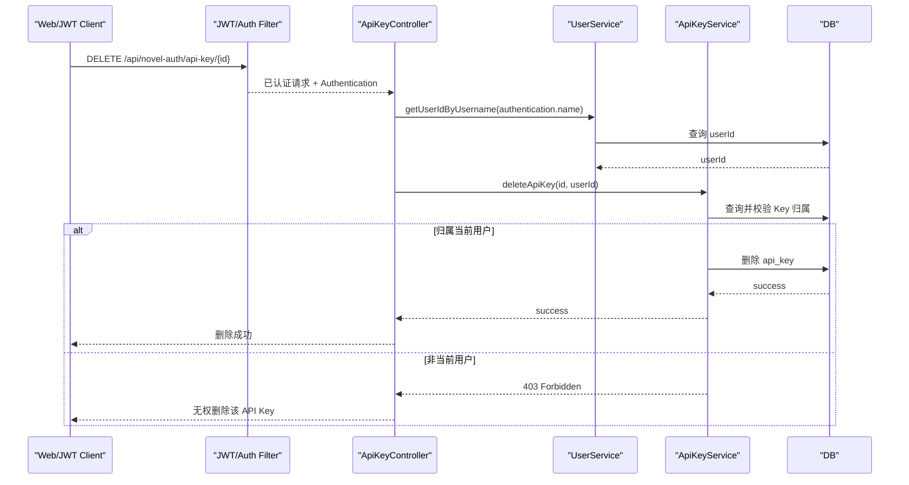

---

### 4. 启用 / 禁用 API Key

```
PATCH /api/novel-auth/api-key/{id}/status
```

**Path 参数**

| 参数 | 类型 | 说明 |
|------|------|------|
| id | long | API Key 主键 ID |

**请求体**

```json
{
  "enabled": 0
}
```

`enabled` 仅支持：
- `1`：启用
- `0`：禁用

**响应示例**

```json
{
  "code": 200,
  "message": "API Key 已禁用",
  "data": null
}
```

**错误码**

| code | errorCode | 说明 |
|------|-----------|------|
| 400 | INVALID_PARAMS | enabled 非 0/1 |
| 403 | - | 当前用户无权操作该 API Key |

**时序图**

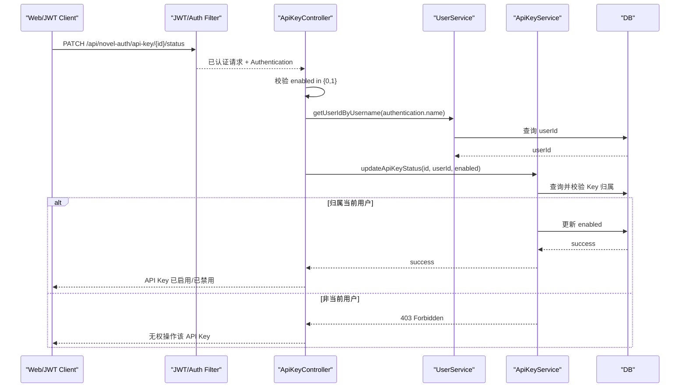

---

## 调用示例（Node.js）

参考 `scripts/create_novel_app.js`，完整流程：

```js
// 1. 创建应用，获取 taskId
const createResp = await fetch('http://localhost:8081/api/agent/app/create', {
  method: 'POST',
  headers: { 'Content-Type': 'application/json', 'X-API-Key': API_KEY },
  body: JSON.stringify(config),
});
const { data: { taskId } } = await createResp.json();

// 2. 轮询任务状态
while (true) {
  await sleep(3000);
  const statusResp = await fetch(`http://localhost:8081/api/agent/task/${taskId}/status`, {
    headers: { 'X-API-Key': API_KEY },
  });
  const { data } = await statusResp.json();
  if (data.status === 'COMPLETED') break;
  if (data.status === 'FAILED') throw new Error(data.errorMessage);
}
```


---

## 附录：query vs detail 接口对比

### 接口功能对比

| 特性 | GET /api/agent/app/query | GET /api/agent/app/detail |
|------|--------------------------|---------------------------|
| **查询条件** | 支持多个（appId、appCode、customer、platform、appName） | 仅支持 appId |
| **参数要求** | 所有参数可选 | appId 必填 |
| **查询优先级** | appId > appCode > 其他条件 | N/A |
| **返回值类型** | 动态（单个对象或数组） | 固定（单个对象） |
| **找到 1 个结果** | 返回单个对象 | 返回单个对象 |
| **找到多个结果** | 返回数组 | N/A（只能查单个） |
| **找不到结果** | 返回空数组 | 返回 400 错误 |
| **应用不存在** | 返回空数组 | 返回 400 错误 |
| **appId 为空** | 忽略该条件 | 返回 400 错误 |
| **错误提示** | 宽松（返回空数组） | 严格（返回错误码） |

### 使用场景对比

| 场景 | 推荐接口 | 说明 |
|------|---------|------|
| 知道 appId，获取详情 | **detail** | 语义更明确，错误提示更严格 |
| 通过 appCode 查询 | **query** | detail 不支持 |
| 查询某个平台的所有应用 | **query** | detail 不支持批量查询 |
| 查询某个客户的所有应用 | **query** | detail 不支持批量查询 |
| 通过应用名称查询 | **query** | detail 不支持 |
| 需要严格的错误提示 | **detail** | 应用不存在时会报错 |
| 批量查询 | **query** | detail 只能查单个 |
| 组合条件查询 | **query** | 支持多条件组合 |

### 调用示例对比

#### query 接口示例

```bash
# 通过 appId 查询（精确）
node agent-scripts/js/app-query.js --app-id tt75c40379eaf96af001

# 通过 appCode 查询（精确）
node agent-scripts/js/app-query.js --app-code tt_miniapp_funnovel

# 通过平台查询（返回多个）
node agent-scripts/js/app-query.js --platform douyin

# 组合查询
node agent-scripts/js/app-query.js --platform douyin --customer funnovel

# 通过应用名称查询
node agent-scripts/js/app-query.js --app-name "风行推广"
```

**返回示例（单个结果）**:
```json
{
  "code": 200,
  "message": "查询成功",
  "data": {
    "baseConfig": { "appid": "tt75c40379eaf96af001", ... },
    "commonConfig": { ... },
    ...
  }
}
```

**返回示例（多个结果）**:
```json
{
  "code": 200,
  "message": "查询成功",
  "data": [
    { "baseConfig": { "appid": "tt75c40379eaf96af001", ... }, ... },
    { "baseConfig": { "appid": "tt75c40379eaf96af002", ... }, ... }
  ]
}
```

**返回示例（无结果）**:
```json
{
  "code": 200,
  "message": "查询成功",
  "data": []
}
```

#### detail 接口示例

```bash
# 通过 appId 查询
node agent-scripts/js/app-detail.js --app-id tt75c40379eaf96af001
```

**返回示例（成功）**:
```json
{
  "code": 200,
  "message": "操作成功",
  "data": {
    "baseConfig": { "appid": "tt75c40379eaf96af001", ... },
    "commonConfig": { ... },
    ...
  }
}
```

**返回示例（应用不存在）**:
```json
{
  "code": 400,
  "message": "应用不存在：tt75c40379eaf96af001",
  "errorCode": "INVALID_PARAMS"
}
```

**返回示例（appId 为空）**:
```json
{
  "code": 400,
  "message": "appId 不能为空",
  "errorCode": "INVALID_PARAMS"
}
```

### 选择建议

**使用 detail 接口的场景**:
- ✅ 你确定知道 appId
- ✅ 你需要严格的错误提示（应用不存在时报错）
- ✅ 你只需要查询单个应用
- ✅ 你希望接口语义更明确

**使用 query 接口的场景**:
- ✅ 你不确定 appId，但知道其他信息（appCode、平台、客户等）
- ✅ 你需要查询多个应用
- ✅ 你需要灵活的查询条件组合
- ✅ 你可以接受返回空数组（而不是报错）
- ✅ 你需要批量查询或模糊查询

### 总结

- **detail** = 精确查询，语义明确，严格校验，适合"我知道 appId，给我详情"的场景
- **query** = 灵活查询，支持多条件，返回动态，适合"我有一些条件，帮我找应用"的场景

两者功能有重叠（都可以通过 appId 查询单个应用），但设计目的不同，应根据实际需求选择合适的接口。

---

## Open API

基础路径: `/open/v1`

> 此模块使用 **Bearer API Key** 认证，在 `Authorization` 请求头中携带：
> ```
> Authorization: Bearer sk-xxxx
> ```

### 验证 API Key 并获取当前用户信息

```
GET /open/v1/me
Authorization: Bearer sk-xxxx
```

用于验证 API Key 是否有效，并返回当前绑定的用户 ID。

**响应示例（成功）**

```json
{
  "success": true,
  "result": {
    "userId": "user_123456"
  }
}
```

**失败情况**

| 情况 | HTTP 状态码 | 响应 |
|------|------------|------|
| 缺少 Authorization 请求头 | 401 | `{"success": false, "message": "缺少 Authorization: Bearer <api_key> 请求头"}` |
| API Key 无效或已禁用 | 401 | `{"success": false, "message": "API Key 无效或已禁用"}` |
| API Key 对应用户不存在 | 401 | `{"success": false, "message": "API Key 对应用户不存在"}` |

**时序图**

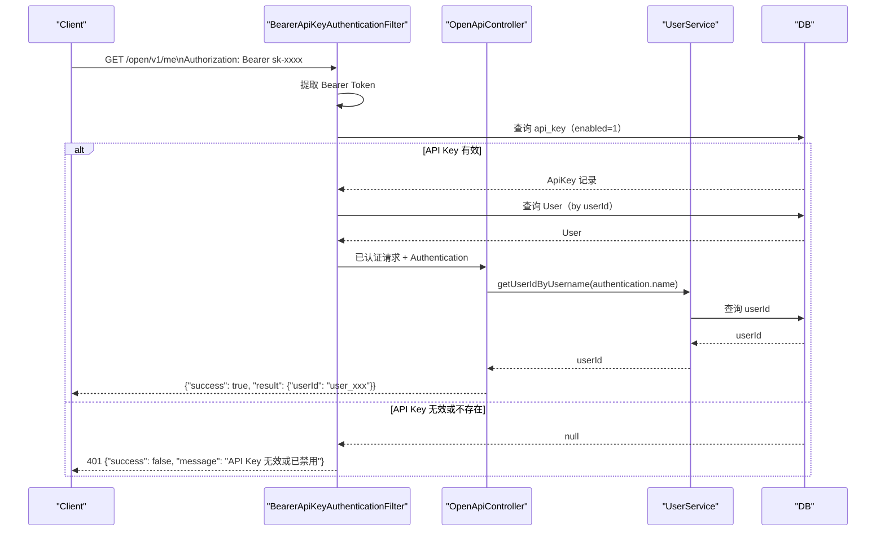
