# Agent 接口业务调用时序图

## 说明

本文汇总 `NovelAppManagerServer/docs/20-Agent接口.md` 中所有 Agent 相关接口的业务调用时序图，便于快速理解请求入口、认证、控制器、业务服务、任务队列与数据库之间的关系。

接口分组：

- Agent 应用管理：`/api/agent/app`
- Agent 构建与发布：`/api/agent`
- Agent 任务状态查询：`/api/agent`
- API Key 管理：`/api/novel-auth/api-keys`

---

## 1. Agent 应用管理

### 1.1 应用列表

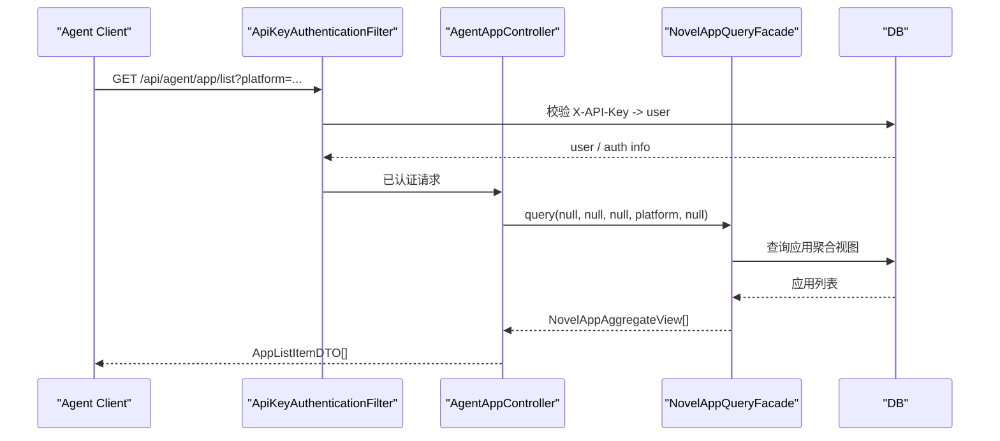

### 1.2 聚合查询

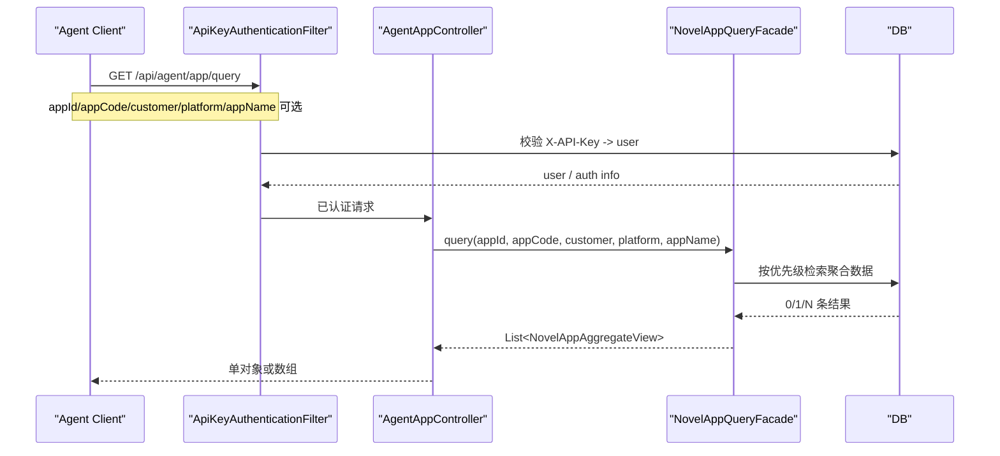

### 1.3 应用详情

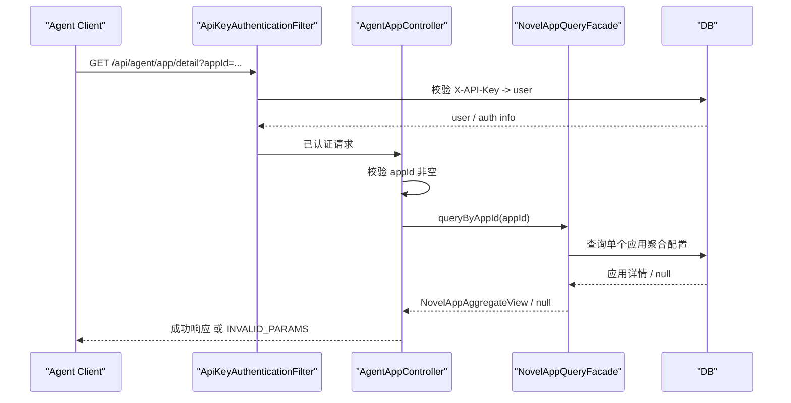

### 1.4 聚合编辑

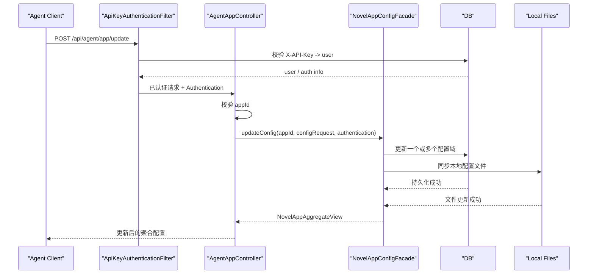

### 1.5 创建应用

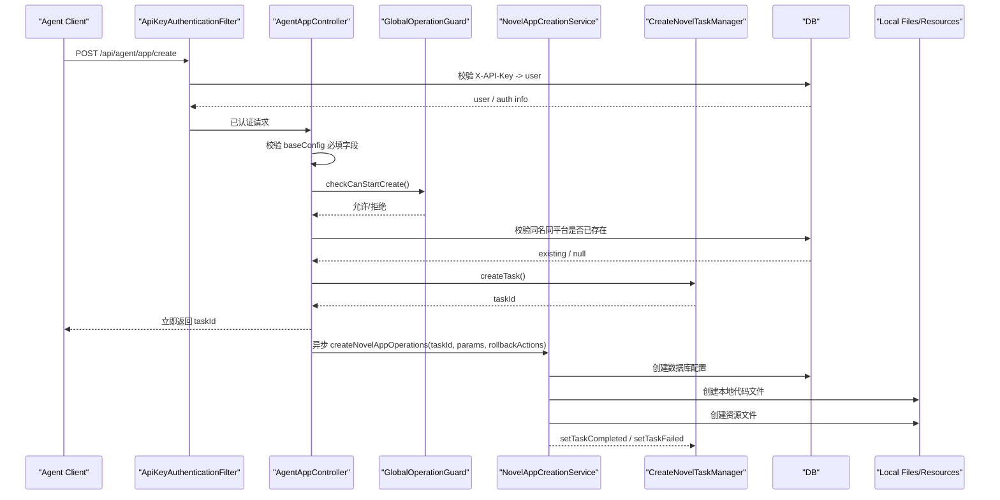

### 1.6 删除应用

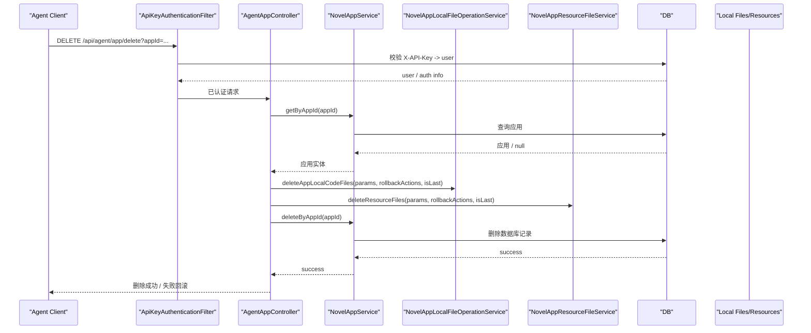

---

## 2. Agent 构建与发布

### 2.1 构建小程序

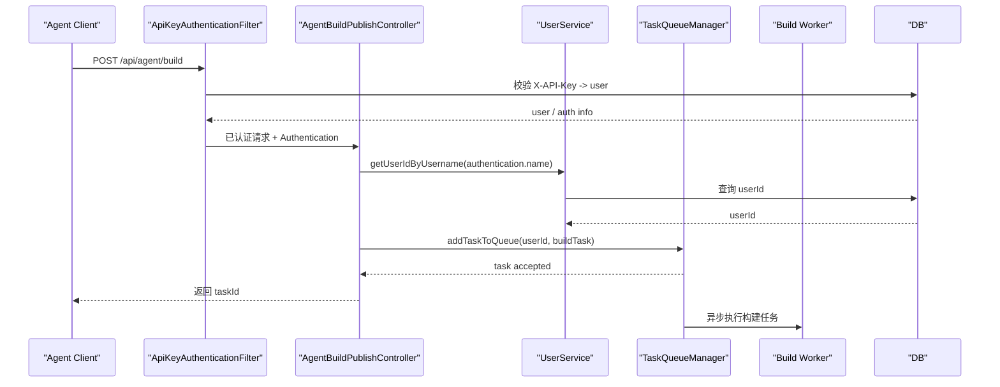

### 2.2 发布小程序

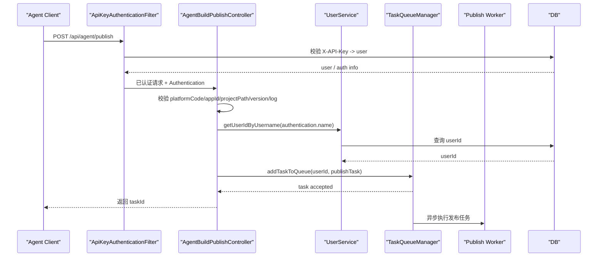

---

## 3. Agent 任务状态查询

### 3.1 查询任务状态

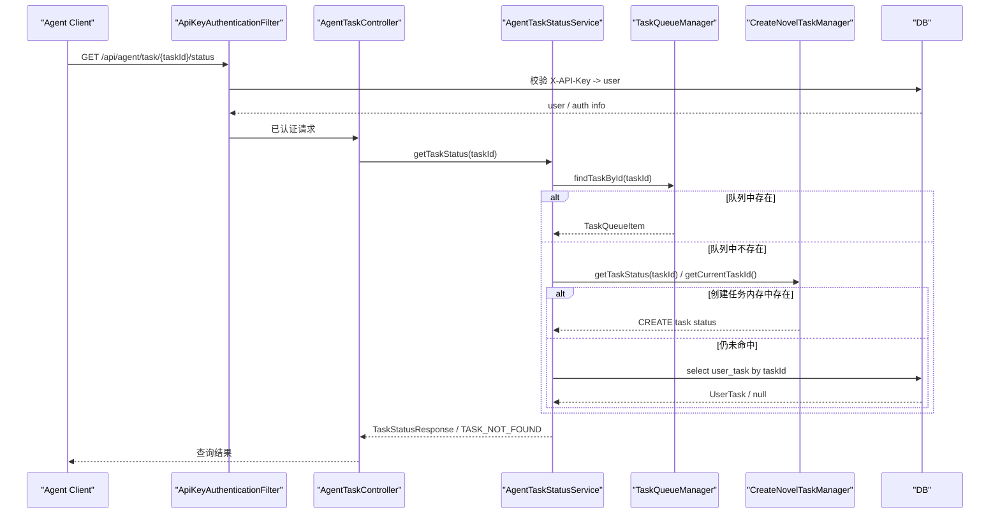

---

## 4. API Key 管理

### 4.1 生成 API Key

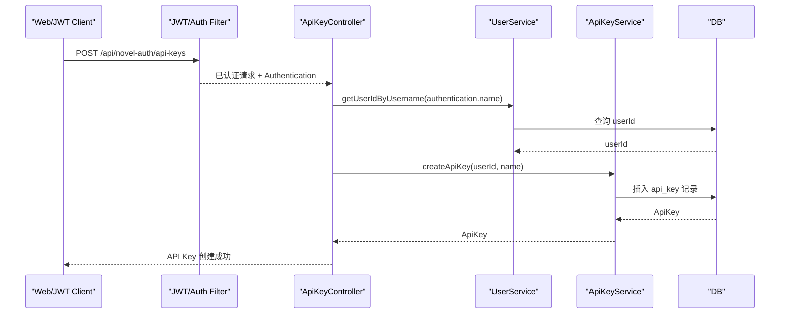

### 4.2 查询 API Key 列表

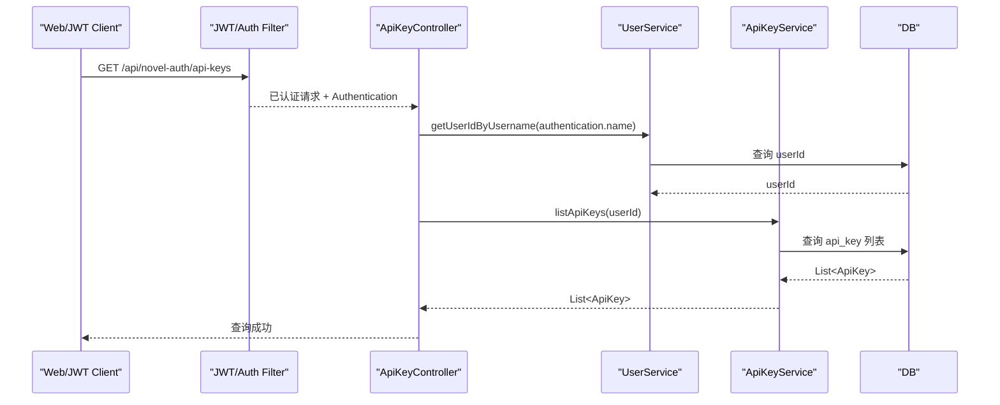

### 4.3 删除 API Key

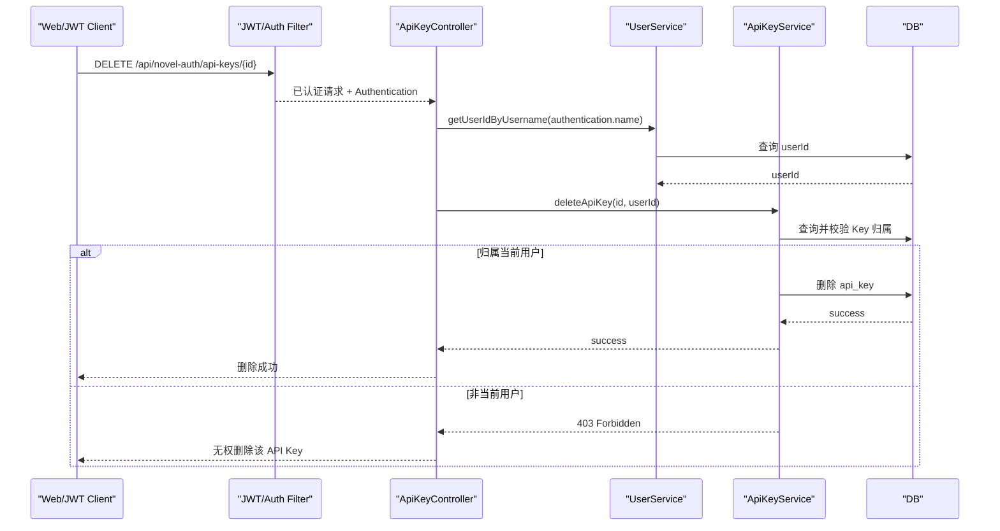

---

## 5. 总结

统一规律如下：

1. Agent 业务接口统一先经过 `ApiKeyAuthenticationFilter` 做 `X-API-Key` 认证，再进入 Controller。
2. 读类接口主要落到 `NovelAppQueryFacade` 或 `AgentTaskStatusService`。
3. 写类接口分两种：
   - 直接修改配置：同步调用 Facade / Service
   - 创建、构建、发布：先返回 `taskId`，再走异步任务链路
4. API Key 管理接口不走 `X-API-Key`，而是走 JWT 鉴权后通过 `ApiKeyController` 直接调用 `ApiKeyService`。
