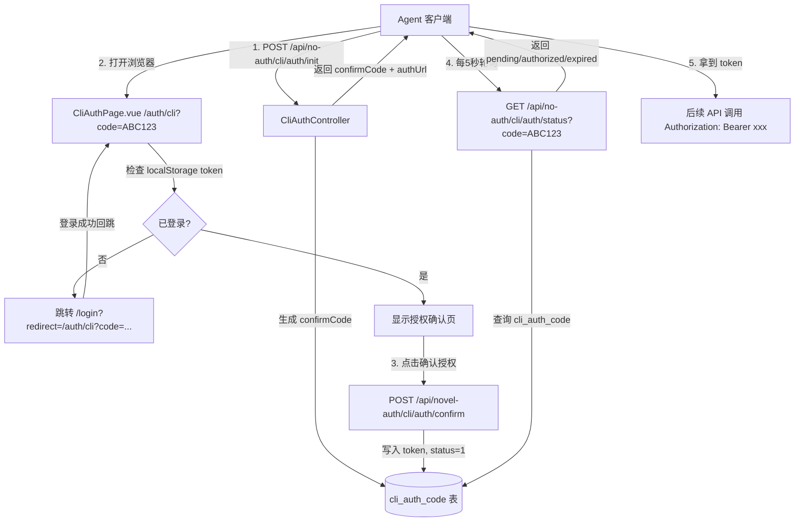
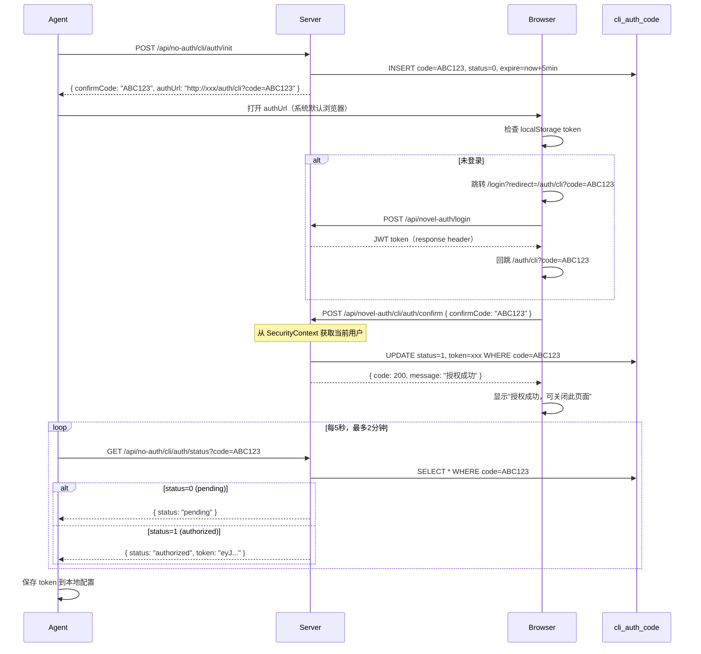
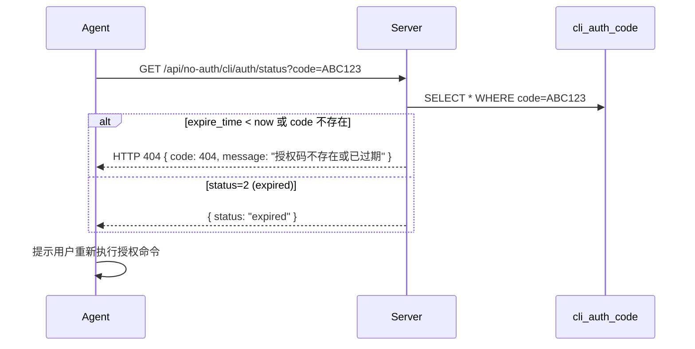

# Design Document: Agent 浏览器授权流程（agent-browser-auth）

## Overview

为 NovelFactoryAI_async 项目实现标准的设备授权流程（Device Authorization Flow），让 Agent 客户端（CLI 工具）无需在命令行输入密码，而是通过打开浏览器完成用户身份确认，最终获取 JWT token 用于后续 API 调用。整体设计参考 podwise-cli 的浏览器授权模式，适配现有 Spring Boot + Vue3 技术栈，无需引入 Redis，直接使用 MySQL 的 `cli_auth_code` 表管理授权码生命周期。

该功能涉及三个层面：后端新增 3 个 REST 接口（init / confirm / status）、前端新增授权确认页（`/auth/cli`）、以及 Agent 客户端的轮询逻辑。授权码有效期 5 分钟，轮询超时 2 分钟，整个流程对用户透明且安全。

## Architecture



## Sequence Diagrams

### 主流程：授权成功



### 异常流程：授权码过期



## Components and Interfaces

### Component 1: CliAuthController（后端）

**Purpose**: 提供 3 个 REST 接口，处理授权码的生命周期

**Interface**:
```java
@RestController
public class CliAuthController {

    // 无需鉴权
    @PostMapping("/api/no-auth/cli/auth/init")
    Result<CliAuthInitResponse> init();

    // 无需鉴权
    @GetMapping("/api/no-auth/cli/auth/status")
    Result<CliAuthStatusResponse> status(@RequestParam String code);

    // 需要 JWT 鉴权（/api/novel-auth/ 前缀）
    @PostMapping("/api/novel-auth/cli/auth/confirm")
    Result<String> confirm(@RequestBody CliAuthConfirmRequest request);
}
```

**Responsibilities**:
- `init`：生成 6 位大写字母数字 confirmCode，写入 DB，返回 authUrl
- `status`：查询授权码状态，若已授权则返回 token，若过期返回 404
- `confirm`：从 Spring Security Context 获取当前登录用户，生成 JWT，更新 DB

---

### Component 2: CliAuthCodeService（后端）

**Purpose**: 封装授权码的业务逻辑，与 MyBatis-Plus Mapper 交互

**Interface**:
```java
public interface CliAuthCodeService extends IService<CliAuthCode> {
    CliAuthCode initAuthCode();
    CliAuthCode getByCode(String code);
    void confirmAuth(String code, Long userId, String token);
    void expireOverdueCode(); // 可选：定时清理过期记录
}
```

---

### Component 3: CliAuthPage.vue（前端）

**Purpose**: 浏览器端授权确认页，处理登录态检查和用户确认操作

**Interface**:
```javascript
// Props（通过 URL query 传入）
// ?code=ABC123

// 内部状态
const state = {
  code: String,        // 从 URL query 读取
  status: 'loading' | 'confirm' | 'success' | 'error',
  errorMsg: String
}

// 方法
async function checkLoginAndConfirm()  // 检查登录态，未登录则跳转
async function confirmAuth()           // 调用 confirm 接口
```

**Responsibilities**:
- 页面加载时读取 URL 中的 `code` 参数
- 检查 `localStorage.getItem('token')` 是否存在
- 未登录：跳转 `/login?redirect=当前URL`（登录成功后回跳）
- 已登录：展示授权确认界面，点击后调用 confirm 接口
- 授权成功后显示提示，告知用户可关闭页面

---

## Data Models

### CliAuthCode 实体

```java
@TableName("cli_auth_code")
public class CliAuthCode {
    @TableId(type = IdType.AUTO)
    private Long id;

    private String code;          // 6位大写字母数字授权短码
    private Long userId;          // 授权后关联的 novel_user.id
    private String token;         // 授权成功后的 JWT token（最长512字符）
    private Integer status;       // 0=pending, 1=authorized, 2=expired
    private LocalDateTime expireTime;  // 过期时间（创建时 +5分钟）
    private LocalDateTime createTime;
}
```

**Validation Rules**:
- `code`：唯一，6位大写字母+数字，由服务端生成，不接受客户端传入
- `status`：只允许 0/1/2，状态只能单向流转（0→1 或 0→2）
- `expireTime`：创建时固定为 `now() + 5 minutes`，不可修改
- `token`：仅在 status=1 时有值，其余为 null

### DTO 定义

```java
// init 接口响应
public class CliAuthInitResponse {
    private String confirmCode;  // "ABC123"
    private String authUrl;      // "http://xxx/auth/cli?code=ABC123"
}

// status 接口响应
public class CliAuthStatusResponse {
    private String status;  // "pending" | "authorized" | "expired"
    private String token;   // 仅 authorized 时有值
}

// confirm 接口请求体
public class CliAuthConfirmRequest {
    private String confirmCode;
}
```

---

## Algorithmic Pseudocode

### init 接口算法

```pascal
PROCEDURE initAuthCode()
  OUTPUT: CliAuthInitResponse

  SEQUENCE
    // 生成唯一短码
    REPEAT
      code ← generateRandomCode(length=6, charset="ABCDEFGHIJKLMNOPQRSTUVWXYZ0123456789")
    UNTIL NOT exists(cli_auth_code WHERE code = code AND expire_time > now())

    // 写入数据库
    record ← new CliAuthCode
    record.code        ← code
    record.status      ← 0  // pending
    record.expireTime  ← now() + 5 minutes
    record.createTime  ← now()
    INSERT record INTO cli_auth_code

    // 构造返回值
    authUrl ← baseUrl + "/auth/cli?code=" + code
    RETURN { confirmCode: code, authUrl: authUrl }
  END SEQUENCE
END PROCEDURE
```

**Preconditions**:
- 无需鉴权，任何客户端均可调用
- `baseUrl` 从 Spring 配置读取（`app.base-url`）

**Postconditions**:
- DB 中存在一条 status=0、5分钟后过期的记录
- 返回的 `confirmCode` 在当前有效期内唯一

---

### status 接口算法

```pascal
PROCEDURE getAuthStatus(code)
  INPUT: code (String)
  OUTPUT: CliAuthStatusResponse 或 HTTP 404

  SEQUENCE
    record ← SELECT FROM cli_auth_code WHERE code = code

    IF record IS NULL THEN
      RETURN HTTP 404 "授权码不存在或已过期"
    END IF

    IF record.expireTime < now() AND record.status = 0 THEN
      UPDATE cli_auth_code SET status = 2 WHERE id = record.id
      RETURN { status: "expired" }
    END IF

    IF record.status = 0 THEN
      RETURN { status: "pending" }
    ELSE IF record.status = 1 THEN
      RETURN { status: "authorized", token: record.token }
    ELSE IF record.status = 2 THEN
      RETURN { status: "expired" }
    END IF
  END SEQUENCE
END PROCEDURE
```

**Preconditions**:
- `code` 参数非空
- 无需鉴权

**Postconditions**:
- 若 code 不存在，返回 404
- 若已过期（status=0 且超时），顺带将 status 更新为 2
- 若 authorized，token 字段有值

---

### confirm 接口算法

```pascal
PROCEDURE confirmAuth(confirmCode, currentUser)
  INPUT: confirmCode (String), currentUser (从 SecurityContext 获取)
  OUTPUT: Result<String>

  SEQUENCE
    record ← SELECT FROM cli_auth_code WHERE code = confirmCode

    IF record IS NULL THEN
      RETURN error("授权码不存在")
    END IF

    IF record.expireTime < now() THEN
      RETURN error("授权码已过期，请重新发起授权")
    END IF

    IF record.status != 0 THEN
      RETURN error("授权码已被使用")
    END IF

    // 生成 JWT token（复用现有 JwtUtil）
    token ← jwtUtil.generateToken(currentUser.getUsername())

    // 更新授权记录
    UPDATE cli_auth_code
      SET status = 1,
          user_id = currentUser.getId(),
          token = token
      WHERE id = record.id

    RETURN success("授权成功")
  END SEQUENCE
END PROCEDURE
```

**Preconditions**:
- 请求必须携带有效 JWT（Spring Security 已验证）
- `confirmCode` 非空

**Postconditions**:
- DB 中对应记录 status=1，token 已写入
- Agent 下次轮询 status 接口时可拿到 token

**Loop Invariants**: N/A（无循环）

---

### 前端授权页算法

```pascal
PROCEDURE onPageLoad(urlQuery)
  INPUT: urlQuery.code (String)

  SEQUENCE
    code ← urlQuery.code

    IF code IS EMPTY THEN
      DISPLAY error("无效的授权链接")
      RETURN
    END IF

    token ← localStorage.getItem("token")

    IF token IS NULL OR token IS EMPTY THEN
      // 未登录，跳转登录页，携带回跳地址
      redirect ← encodeURIComponent(currentFullUrl)
      navigate("/login?redirect=" + redirect)
      RETURN
    END IF

    // 已登录，展示确认界面
    DISPLAY confirmButton("确认授权给 NovelFactoryAI Agent")
  END SEQUENCE
END PROCEDURE

PROCEDURE onConfirmClick(code)
  INPUT: code (String)

  SEQUENCE
    SET buttonLoading ← true

    response ← POST /api/novel-auth/cli/auth/confirm
                  BODY: { confirmCode: code }
                  HEADER: Authorization: Bearer <localStorage.token>

    IF response.code = 200 THEN
      DISPLAY "授权成功！可以关闭此页面，返回命令行继续操作。"
    ELSE
      DISPLAY error(response.message)
    END IF

    SET buttonLoading ← false
  END SEQUENCE
END PROCEDURE
```

---

## Key Functions with Formal Specifications

### generateRandomCode()

```java
private String generateRandomCode(int length)
```

**Preconditions**:
- `length > 0`（当前固定为 6）

**Postconditions**:
- 返回长度为 `length` 的字符串
- 字符集为 `[A-Z0-9]`（36个字符）
- 使用 `SecureRandom` 保证随机性

---

### CliAuthCodeServiceImpl.confirmAuth()

```java
void confirmAuth(String code, Long userId, String token)
```

**Preconditions**:
- `code` 在 DB 中存在且 status=0
- `expireTime > now()`
- `userId` 对应 `novel_user` 中的有效用户
- `token` 是由 `JwtUtil.generateToken()` 生成的有效 JWT

**Postconditions**:
- DB 中 `status=1`，`user_id=userId`，`token=token`
- 操作是原子的（单条 UPDATE，无并发问题）

---

## Error Handling

### 场景 1：授权码不存在或已过期（status 接口）

**Condition**: Agent 轮询时 code 不在 DB 中，或 expire_time 已过
**Response**: HTTP 404，`{ code: 404, message: "授权码不存在或已过期" }`
**Recovery**: Agent 提示用户重新执行授权命令

---

### 场景 2：用户未登录直接访问授权页

**Condition**: 浏览器访问 `/auth/cli?code=ABC123` 时 localStorage 无 token
**Response**: 前端跳转 `/login?redirect=/auth/cli?code=ABC123`
**Recovery**: 用户登录成功后，Vue Router 自动回跳到授权页

---

### 场景 3：授权码已被使用（重复 confirm）

**Condition**: 同一 code 被 confirm 两次（status 已为 1）
**Response**: `{ code: 400, message: "授权码已被使用" }`
**Recovery**: 前端显示错误提示，无需额外操作

---

### 场景 4：Agent 轮询超时（2分钟内用户未确认）

**Condition**: Agent 轮询 24 次（2分钟）后仍为 pending
**Response**: Agent 客户端主动停止轮询，提示超时
**Recovery**: 用户重新执行授权命令，服务端旧记录自然过期

---

### 场景 5：confirm 时 JWT 已过期

**Condition**: 用户浏览器中的 token 已过期，confirm 请求被 Spring Security 拦截
**Response**: HTTP 401，`{ code: 401, message: "JWT Token已过期" }`
**Recovery**: 前端检测到 401 后跳转登录页重新登录

---

## Testing Strategy

### Unit Testing Approach

- `CliAuthCodeServiceImpl`：测试 `initAuthCode()`、`confirmAuth()`、`getByCode()` 的正常和异常路径
- `generateRandomCode()`：验证长度、字符集、唯一性（多次调用无重复）
- 状态流转：验证 pending→authorized、pending→expired 的合法性，以及非法流转被拒绝

### Property-Based Testing Approach

**Property Test Library**: JUnit 5 + jqwik（Java PBT 库）

关键属性：
- `∀ code ∈ generateRandomCode()：len(code) = 6 ∧ code ⊆ [A-Z0-9]`
- `∀ record ∈ cli_auth_code：status ∈ {0, 1, 2}`
- `∀ confirm(code)：若 expireTime < now() → 返回错误，不修改 DB`

### Integration Testing Approach

- 完整流程测试：init → confirm → status 三接口串联
- Spring Security 白名单验证：`/api/no-auth/**` 无 token 可访问，`/api/novel-auth/cli/auth/confirm` 无 token 返回 401
- 并发测试：同一 code 并发 confirm 两次，验证只有一次成功

---

## Performance Considerations

- `cli_auth_code` 表数据量极小（内部团队使用，并发极低），无需额外索引优化
- `code` 字段已有 `UNIQUE KEY uk_code`，status 查询走主键或 code 索引，性能充足
- 无需 Redis：5分钟过期的短码直接用 MySQL 管理，轮询频率（5秒/次）对 DB 无压力
- 可选：每天定时清理 7 天前的过期记录，防止表无限增长

---

## Security Considerations

- **confirmCode 不可预测**：使用 `SecureRandom` 生成，36^6 ≈ 21亿种组合，暴力枚举不可行
- **有效期限制**：5分钟过期，降低 code 泄露风险
- **confirm 需要鉴权**：`/api/novel-auth/cli/auth/confirm` 在 Spring Security 认证链中，必须携带有效 JWT
- **token 不在 URL 中传输**：status 接口通过 JSON body 返回 token，不暴露在日志或浏览器历史中
- **一次性使用**：code 一旦 confirm 成功（status=1），再次 confirm 返回错误

---

## Dependencies

### 后端

- Spring Boot（已有）
- Spring Security（已有）
- MyBatis-Plus（已有）
- `JwtUtil.generateToken(username)`（已有）
- MySQL `db_novelapp`（已有，新增 `cli_auth_code` 表）

### 前端

- Vue 3（已有）
- Vue Router（已有）
- Element Plus（已有）
- axios / fetch（已有，复用现有 HTTP 工具）

### 新增文件清单

**后端**：
- `entity/CliAuthCode.java`
- `mapper/CliAuthCodeMapper.java`
- `service/CliAuthCodeService.java`
- `service/impl/CliAuthCodeServiceImpl.java`
- `controller/CliAuthController.java`
- `dto/CliAuthInitResponse.java`
- `dto/CliAuthStatusResponse.java`
- `dto/CliAuthConfirmRequest.java`
- `SecurityConfig.java`：白名单新增 `/api/no-auth/cli/auth/**`

**前端**：
- `views/CliAuthPage.vue`
- `router/index.js`：新增 `/auth/cli` 路由

**数据库**：
- `sql_novel/novel.sql`：新增 `cli_auth_code` 表 DDL
