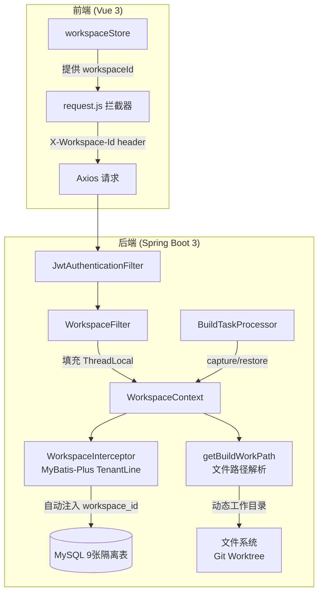
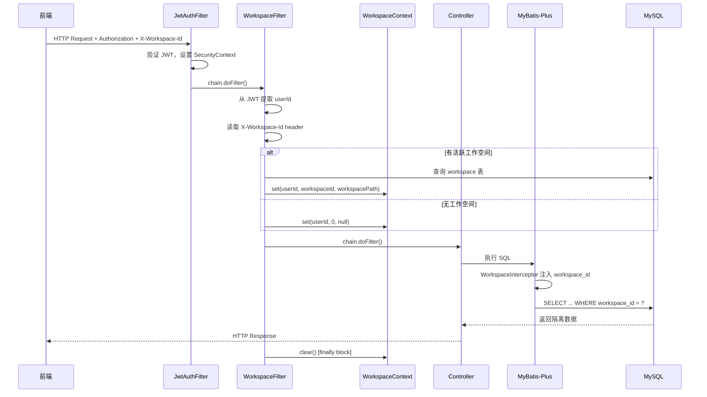
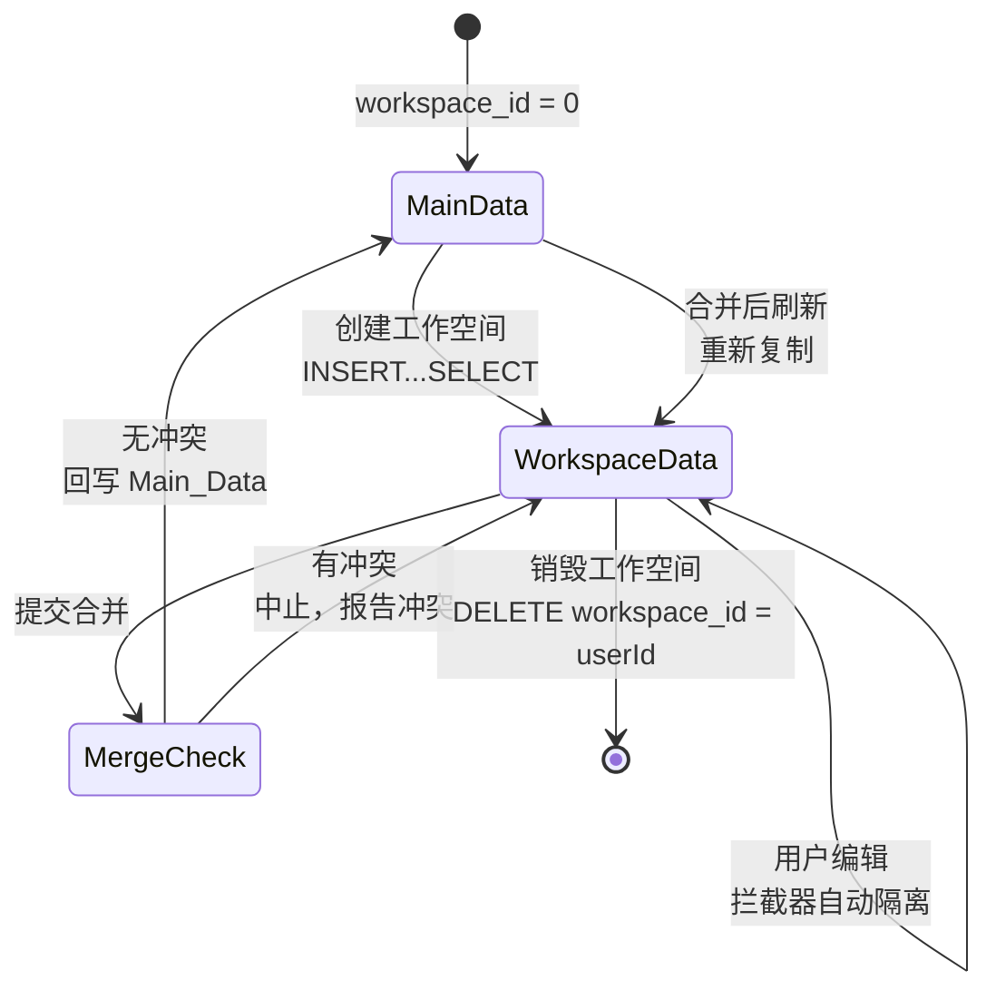

# Design Document: Workspace DB Isolation

## Overview

本设计为 NovelAppManager 平台补齐工作空间数据库隔离能力。在已有的 Git Worktree 文件级隔离基础上，增加三层基础设施：

1. **请求级工作空间上下文（WorkspaceContext）**：基于 ThreadLocal 的上下文持有者，在 Servlet Filter 中填充，为后续的文件路径解析和数据库拦截器提供统一的 userId / workspaceId / workspacePath 数据源。支持 capture/restore 机制以传播到异步线程。

2. **文件写入路径工作空间感知**：将 `AbstractConfigFileOperationService`、`ConfigFilePreprocessor`、`AppUploadCheckService` 中硬编码的 `@Value` 路径字段替换为动态方法，优先从 WorkspaceContext 读取工作空间路径，无活跃工作空间时回退到默认配置值。

3. **数据库逻辑隔离**：为 9 张配置表添加 `workspace_id` 字段，通过 MyBatis-Plus `TenantLineInnerInterceptor` 自动注入条件。配合数据复制（创建时）、数据合并（审批时）、数据清理（销毁时）三个生命周期操作，实现同库同表的多工作空间数据隔离。

### 设计目标

- **零业务代码侵入**：现有 Controller / Service 层代码无需修改即可获得工作空间感知能力
- **向后兼容**：无活跃工作空间时（workspaceId=0），系统行为与改造前完全一致
- **事务安全**：数据复制、合并、清理均在单事务内完成，失败时完整回滚
- **线程安全**：ThreadLocal 上下文在请求结束时清理，异步线程通过 capture/restore 显式传播

## Architecture

### 整体架构图



### 请求处理流程



### 数据生命周期



## Components and Interfaces

### 1. WorkspaceContext（请求级上下文）

**包路径**: `com.fun.novel.workspace.context.WorkspaceContext`

```java
public final class WorkspaceContext {
    private static final ThreadLocal<Long> USER_ID = ThreadLocal.withInitial(() -> 0L);
    private static final ThreadLocal<Long> WORKSPACE_ID = ThreadLocal.withInitial(() -> 0L);
    private static final ThreadLocal<String> WORKSPACE_PATH = new ThreadLocal<>();

    // 设置上下文
    public static void set(Long userId, Long workspaceId, String workspacePath);
    
    // 访问器
    public static Long getCurrentUserId();
    public static Long getCurrentWorkspaceId();    // 默认 0
    public static String getCurrentWorkspacePath(); // 默认 null
    
    // 清理
    public static void clear();
    
    // 异步传播
    public static Snapshot capture();
    public static void restore(Snapshot snapshot);
    
    // 不可变快照
    public record Snapshot(Long userId, Long workspaceId, String workspacePath) {}
}
```

**设计决策**：使用 Java 17 record 作为 Snapshot 类型，天然不可变且线程安全，无需额外同步。

### 2. WorkspaceFilter（Servlet Filter）

**包路径**: `com.fun.novel.workspace.filter.WorkspaceFilter`

```java
@Component
@Order(Ordered.HIGHEST_PRECEDENCE + 100) // JWT Filter 之后
public class WorkspaceFilter extends OncePerRequestFilter {
    
    @Autowired
    private JwtUtil jwtUtil;
    
    @Autowired
    private WorkspaceMapper workspaceMapper;
    
    @Override
    protected void doFilterInternal(HttpServletRequest request,
                                     HttpServletResponse response,
                                     FilterChain chain) {
        try {
            // 1. 从 JWT 提取 userId
            Long userId = extractUserIdFromJwt(request);
            if (userId == null) {
                chain.doFilter(request, response);
                return;
            }
            
            // 2. 读取 X-Workspace-Id header
            String wsHeader = request.getHeader("X-Workspace-Id");
            Long workspaceId = parseWorkspaceId(wsHeader);
            
            // 3. 填充 WorkspaceContext
            if (workspaceId != null && workspaceId > 0) {
                Workspace ws = lookupActiveWorkspace(userId);
                WorkspaceContext.set(userId, userId, ws.getWorkspacePath());
            } else {
                WorkspaceContext.set(userId, 0L, null);
            }
            
            chain.doFilter(request, response);
        } finally {
            WorkspaceContext.clear();
        }
    }
}
```

**设计决策**：
- `workspaceId` 使用 `userId` 作为值（而非 workspace 表的自增 ID），与数据库 `workspace_id` 字段语义一致
- Filter 使用 `@Order` 注解确保在 JWT Filter 之后执行
- 使用 `OncePerRequestFilter` 避免在 forward/include 场景下重复执行

### 3. WorkspaceInterceptor（MyBatis-Plus 拦截器）

**包路径**: `com.fun.novel.workspace.interceptor.WorkspaceInterceptor`

```java
public class WorkspaceInterceptor extends TenantLineInnerInterceptor {
    
    private static final Set<String> ISOLATED_TABLES = Set.of(
        "ad_config", "app_ad", "app_common_config", "app_pay",
        "app_preview_page", "app_ui_config", "app_weiju_business_type",
        "app_weiju_public_switch", "novel_app"
    );
    
    @Override
    public Expression getTenantId() {
        return new LongValue(WorkspaceContext.getCurrentWorkspaceId());
    }
    
    @Override
    public String getTenantIdColumn() {
        return "workspace_id";
    }
    
    @Override
    public boolean ignoreTable(String tableName) {
        return !ISOLATED_TABLES.contains(tableName.toLowerCase());
    }
}
```

**注册方式**：在 `MybatisPlusConfig` 中，将 `WorkspaceInterceptor` 添加到 `MybatisPlusInterceptor` 插件链中，且必须在 `PaginationInnerInterceptor` **之前**添加（MyBatis-Plus 要求 TenantLine 在 Pagination 之前）。

### 4. 文件路径工作空间感知

#### AbstractConfigFileOperationService 改造

```java
public abstract class AbstractConfigFileOperationService {
    
    @Value("${build.workPath}")
    private String defaultBuildWorkPath;  // 改为 private，仅作 fallback
    
    protected String getBuildWorkPath() {
        String wsPath = WorkspaceContext.getCurrentWorkspacePath();
        return wsPath != null ? wsPath : defaultBuildWorkPath;
    }
    
    // 所有子类中的 buildWorkPath 引用改为 getBuildWorkPath() 调用
}
```

#### ConfigFilePreprocessor 改造

```java
@Component
public class ConfigFilePreprocessor {
    
    @Value("${build.testWorkPath}")
    private String defaultTestWorkPath;  // 改为 private
    
    private String getTestWorkPath() {
        String wsPath = WorkspaceContext.getCurrentWorkspacePath();
        return wsPath != null ? wsPath : defaultTestWorkPath;
    }
    
    // 所有 testWorkPath 引用改为 getTestWorkPath() 调用
}
```

#### AppUploadCheckService 改造

```java
@Service
public class AppUploadCheckService {
    
    @Value("${build.workPath}")
    private String defaultBuildWorkPath;  // 改为 private
    
    private String getBuildWorkPath() {
        String wsPath = WorkspaceContext.getCurrentWorkspacePath();
        return wsPath != null ? wsPath : defaultBuildWorkPath;
    }
    
    // 所有 buildWorkPath 引用改为 getBuildWorkPath() 调用
}
```

### 5. BuildTaskProcessor 异步上下文传播

```java
@Service
public class BuildTaskProcessor implements TaskProcessor<String> {
    
    @Override
    public void process(TaskQueueItem task, String command) {
        // 在主线程中捕获上下文
        WorkspaceContext.Snapshot snapshot = WorkspaceContext.capture();
        
        // 异步执行时恢复上下文
        CompletableFuture.runAsync(() -> {
            try {
                WorkspaceContext.restore(snapshot);
                // ... 执行构建逻辑 ...
            } finally {
                WorkspaceContext.clear();
            }
        });
    }
}
```

**注意**：当前 `BuildTaskProcessor.process()` 本身已在异步线程中被调用（由任务队列调度），因此 capture 需要在调度方（提交任务的 Controller/Service）完成，restore 在 `process()` 方法开头执行。具体实现需要在任务队列的 dispatch 层面传递 Snapshot。

### 6. DataCopier（数据复制服务）

**包路径**: `com.fun.novel.workspace.service.DataCopierService`

```java
@Service
public class DataCopierService {
    
    @Autowired
    private JdbcTemplate jdbcTemplate;
    
    private static final List<String> ISOLATED_TABLES = List.of(
        "ad_config", "app_ad", "app_common_config", "app_pay",
        "app_preview_page", "app_ui_config", "app_weiju_business_type",
        "app_weiju_public_switch", "novel_app"
    );
    
    @Transactional(rollbackFor = Exception.class)
    public void copyMainDataToWorkspace(Long userId) {
        for (String table : ISOLATED_TABLES) {
            String columns = getColumnsExceptWorkspaceId(table);
            String sql = String.format(
                "INSERT INTO %s (%s, workspace_id) SELECT %s, %d FROM %s WHERE workspace_id = 0",
                table, columns, columns, userId, table
            );
            jdbcTemplate.execute(sql);
        }
    }
}
```

**设计决策**：使用 `JdbcTemplate` 执行原生 SQL 而非 MyBatis-Plus API，因为 `INSERT...SELECT` 跨 workspace_id 操作需要绕过 TenantLine 拦截器。拦截器会自动为 INSERT 设置 workspace_id，但 SELECT 部分需要读取 workspace_id=0 的数据，这与当前上下文的 workspace_id 不同。

### 7. DataMerger（数据合并服务）

**包路径**: `com.fun.novel.workspace.service.DataMergerService`

```java
@Service
public class DataMergerService {
    
    @Transactional(rollbackFor = Exception.class)
    public void mergeWorkspaceToMain(Long userId, LocalDateTime dbBaselineVersion) {
        for (String table : ISOLATED_TABLES) {
            // 1. 检测冲突：Main_Data 中 updated_at > dbBaselineVersion 的行
            List<Map<String, Object>> conflicts = detectConflicts(table, dbBaselineVersion);
            if (!conflicts.isEmpty()) {
                throw new DataConflictException(table, conflicts);
            }
            
            // 2. 识别变更：比较 workspace_id=userId 与 workspace_id=0
            // 3. 应用变更到 Main_Data
            applyChanges(table, userId);
        }
    }
}
```

### 8. 前端 X-Workspace-Id Header 注入

**修改文件**: `NovelAppManager/src/utils/request.js`

```javascript
// 在请求拦截器中添加
import { useWorkspaceStore } from '../stores/workspaceStore'

request.interceptors.request.use(config => {
    // ... 现有 Authorization header 逻辑 ...
    
    // 注入工作空间标识
    const workspaceStore = useWorkspaceStore()
    if (workspaceStore.currentWorkspaceId) {
        config.headers['X-Workspace-Id'] = workspaceStore.currentWorkspaceId
    }
    
    return config
})
```

**修改文件**: `NovelAppManager/src/stores/workspaceStore.js`

新增 `currentWorkspaceId` state 字段，在 `syncWorkspace` 和 `getStatus` 成功后设置，在 workspace 销毁时清除。

## Data Models

### workspace 表（已有，新增字段）

| 字段 | 类型 | 说明 |
|------|------|------|
| id | BIGINT AUTO_INCREMENT | 主键 |
| user_id | BIGINT | 用户ID |
| workspace_path | VARCHAR(500) | 文件系统路径 |
| branch_name | VARCHAR(200) | Git 分支名 |
| status | VARCHAR(20) | active / destroyed |
| last_active_time | DATETIME | 最后活跃时间 |
| **db_baseline_version** | **DATETIME** | **数据基线版本（新增）** |
| created_at | DATETIME | 创建时间 |
| updated_at | DATETIME | 更新时间 |

### 9 张隔离表（新增字段）

每张表新增：

| 字段 | 类型 | 默认值 | 说明 |
|------|------|--------|------|
| workspace_id | BIGINT NOT NULL | 0 | 0=主数据，userId=工作空间数据 |

新增索引：`idx_workspace_id` on `workspace_id`

### SQL Migration Script

```sql
-- 1. workspace 表新增 db_baseline_version
ALTER TABLE workspace ADD COLUMN IF NOT EXISTS 
    db_baseline_version DATETIME DEFAULT NULL 
    COMMENT '数据基线版本时间戳';

-- 2. 9 张隔离表新增 workspace_id + 索引
ALTER TABLE ad_config ADD COLUMN IF NOT EXISTS 
    workspace_id BIGINT NOT NULL DEFAULT 0 COMMENT '工作空间ID，0为主数据';
CREATE INDEX IF NOT EXISTS idx_workspace_id ON ad_config(workspace_id);

ALTER TABLE app_ad ADD COLUMN IF NOT EXISTS 
    workspace_id BIGINT NOT NULL DEFAULT 0 COMMENT '工作空间ID，0为主数据';
CREATE INDEX IF NOT EXISTS idx_workspace_id ON app_ad(workspace_id);

ALTER TABLE app_common_config ADD COLUMN IF NOT EXISTS 
    workspace_id BIGINT NOT NULL DEFAULT 0 COMMENT '工作空间ID，0为主数据';
CREATE INDEX IF NOT EXISTS idx_workspace_id ON app_common_config(workspace_id);

ALTER TABLE app_pay ADD COLUMN IF NOT EXISTS 
    workspace_id BIGINT NOT NULL DEFAULT 0 COMMENT '工作空间ID，0为主数据';
CREATE INDEX IF NOT EXISTS idx_workspace_id ON app_pay(workspace_id);

ALTER TABLE app_preview_page ADD COLUMN IF NOT EXISTS 
    workspace_id BIGINT NOT NULL DEFAULT 0 COMMENT '工作空间ID，0为主数据';
CREATE INDEX IF NOT EXISTS idx_workspace_id ON app_preview_page(workspace_id);

ALTER TABLE app_ui_config ADD COLUMN IF NOT EXISTS 
    workspace_id BIGINT NOT NULL DEFAULT 0 COMMENT '工作空间ID，0为主数据';
CREATE INDEX IF NOT EXISTS idx_workspace_id ON app_ui_config(workspace_id);

ALTER TABLE app_weiju_business_type ADD COLUMN IF NOT EXISTS 
    workspace_id BIGINT NOT NULL DEFAULT 0 COMMENT '工作空间ID，0为主数据';
CREATE INDEX IF NOT EXISTS idx_workspace_id ON app_weiju_business_type(workspace_id);

ALTER TABLE app_weiju_public_switch ADD COLUMN IF NOT EXISTS 
    workspace_id BIGINT NOT NULL DEFAULT 0 COMMENT '工作空间ID，0为主数据';
CREATE INDEX IF NOT EXISTS idx_workspace_id ON app_weiju_public_switch(workspace_id);

ALTER TABLE novel_app ADD COLUMN IF NOT EXISTS 
    workspace_id BIGINT NOT NULL DEFAULT 0 COMMENT '工作空间ID，0为主数据';
CREATE INDEX IF NOT EXISTS idx_workspace_id ON novel_app(workspace_id);
```

### Entity 类变更

每个隔离表对应的 Entity 类需要新增 `workspaceId` 字段：

```java
@TableField("workspace_id")
private Long workspaceId;
```

Workspace Entity 新增：

```java
@TableField("db_baseline_version")
private LocalDateTime dbBaselineVersion;
```

## Correctness Properties

*A property is a characteristic or behavior that should hold true across all valid executions of a system — essentially, a formal statement about what the system should do. Properties serve as the bridge between human-readable specifications and machine-verifiable correctness guarantees.*

### Property 1: WorkspaceContext set/get/clear round-trip

*For any* random triple of (userId: Long, workspaceId: Long, workspacePath: String), calling `WorkspaceContext.set(userId, workspaceId, workspacePath)` followed by the corresponding getters SHALL return the exact same values; and after calling `WorkspaceContext.clear()`, `getCurrentWorkspaceId()` SHALL return 0 and `getCurrentWorkspacePath()` SHALL return null.

**Validates: Requirements 1.1, 1.3, 1.4, 1.5, 1.6**

### Property 2: WorkspaceContext capture/restore cross-thread round-trip

*For any* random triple of (userId, workspaceId, workspacePath), setting the context on thread A, calling `capture()`, then calling `restore(snapshot)` on a different thread B SHALL result in thread B's getters returning the same values as thread A had before capture.

**Validates: Requirements 3.1, 3.2, 3.4**

### Property 3: Workspace-aware path resolution

*For any* random non-null workspacePath string set in WorkspaceContext, calling `getBuildWorkPath()` (on AbstractConfigFileOperationService or AppUploadCheckService) or `getTestWorkPath()` (on ConfigFilePreprocessor) SHALL return that workspacePath value. When WorkspaceContext contains a null workspacePath, the methods SHALL return their respective default `@Value` paths.

**Validates: Requirements 4.2, 4.3, 5.2, 5.3, 6.2, 6.3**

### Property 4: Table isolation filter correctness

*For any* table name string, `WorkspaceInterceptor.ignoreTable(tableName)` SHALL return `false` if and only if the lowercased table name is one of the 9 isolated tables (`ad_config`, `app_ad`, `app_common_config`, `app_pay`, `app_preview_page`, `app_ui_config`, `app_weiju_business_type`, `app_weiju_public_switch`, `novel_app`), and SHALL return `true` for all other table names.

**Validates: Requirements 9.3**

### Property 5: Data copy preserves Main_Data with correct workspace_id

*For any* set of Main_Data rows (workspace_id=0) across the 9 isolated tables, after `DataCopierService.copyMainDataToWorkspace(userId)` completes, the number of rows with `workspace_id=userId` in each table SHALL equal the number of rows with `workspace_id=0`, and each copied row's non-workspace_id columns SHALL match the corresponding Main_Data row.

**Validates: Requirements 10.1**

### Property 6: Conflict detection via timestamp comparison

*For any* Main_Data row in an isolated table whose `updated_at` timestamp is strictly after the workspace's `db_baseline_version`, the `DataMergerService` SHALL detect it as a conflict and abort the merge transaction. Conversely, *for any* Main_Data row whose `updated_at` is at or before `db_baseline_version`, it SHALL NOT be flagged as a conflict.

**Validates: Requirements 11.3, 14.4**

### Property 7: Data cleanup removes all workspace rows

*For any* userId with workspace data across the 9 isolated tables, after executing the cleanup operation, the count of rows with `workspace_id=userId` in each of the 9 tables SHALL be 0, and the count of rows with `workspace_id=0` (Main_Data) SHALL remain unchanged.

**Validates: Requirements 12.1**

## Error Handling

### WorkspaceFilter 错误处理

| 场景 | 处理方式 |
|------|----------|
| JWT 缺失或无效 | 跳过 WorkspaceContext 填充，放行到 Spring Security 认证错误处理 |
| X-Workspace-Id header 格式错误 | 忽略 header，使用 workspaceId=0（主数据模式） |
| workspace 表查询失败 | 记录 WARN 日志，使用 workspaceId=0 回退 |
| ThreadLocal 泄漏 | finally 块中始终调用 clear()，即使 chain.doFilter() 抛出异常 |

### 数据复制错误处理

| 场景 | 处理方式 |
|------|----------|
| 任一表 INSERT...SELECT 失败 | `@Transactional` 回滚全部 9 表操作，向调用方抛出异常 |
| 调用方收到异常 | WorkspaceManagerService 清理已创建的 Git Worktree |

### 数据合并错误处理

| 场景 | 处理方式 |
|------|----------|
| 检测到数据冲突 | 抛出 `DataConflictException`，包含冲突表名和行标识 |
| 合并 SQL 执行失败 | `@Transactional` 回滚，Main_Data 保持不变 |
| 合并后刷新失败 | 记录 ERROR 日志，下次 sync 时修复 |

### 数据清理错误处理

| 场景 | 处理方式 |
|------|----------|
| 任一表 DELETE 失败 | 记录 ERROR 日志（含表名和 userId），加入清理重试队列 |
| 重试队列处理 | 定时任务扫描重试队列，重新执行清理 |

### 异步线程错误处理

| 场景 | 处理方式 |
|------|----------|
| capture() 在无上下文时调用 | 返回默认快照 (0, 0, null) |
| restore() 后未调用 clear() | 线程池复用时可能泄漏，必须在 finally 中 clear() |
| 构建任务异常 | finally 块中清理 WorkspaceContext |

## Testing Strategy

### 测试框架选择

- **后端单元测试**: JUnit 5 + Mockito
- **后端属性测试**: jqwik（Java property-based testing library for JUnit 5）
- **后端集成测试**: Spring Boot Test + H2 内存数据库
- **前端单元测试**: Vitest + Vue Test Utils

### 双重测试策略

#### 属性测试（Property-Based Tests）

每个 Correctness Property 对应一个 jqwik 属性测试，最少 100 次迭代：

| Property | 测试类 | 说明 |
|----------|--------|------|
| P1: Context round-trip | `WorkspaceContextPropertyTest` | 随机生成 userId/workspaceId/path，验证 set/get/clear |
| P2: Capture/restore | `WorkspaceContextPropertyTest` | 跨线程 capture/restore 验证 |
| P3: Path resolution | `WorkspacePathResolutionPropertyTest` | 随机 path 验证 getBuildWorkPath/getTestWorkPath |
| P4: Table filter | `WorkspaceInterceptorPropertyTest` | 随机表名验证 ignoreTable |
| P5: Data copy | `DataCopierPropertyTest` | 随机数据行验证复制正确性 |
| P6: Conflict detection | `DataMergerPropertyTest` | 随机时间戳验证冲突检测 |
| P7: Data cleanup | `DataCleanupPropertyTest` | 随机数据验证清理完整性 |

**配置要求**：
- 每个属性测试最少 100 次迭代
- 每个测试标注 tag：`Feature: workspace-db-isolation, Property {N}: {title}`

#### 单元测试（Example-Based Tests）

| 测试目标 | 测试类 | 关键用例 |
|----------|--------|----------|
| WorkspaceFilter | `WorkspaceFilterTest` | JWT 缺失跳过、header 解析、finally 清理 |
| WorkspaceInterceptor | `WorkspaceInterceptorTest` | getTenantId 返回值、getTenantIdColumn 返回 "workspace_id" |
| getBuildWorkPath fallback | `AbstractConfigServiceTest` | null path 回退到默认值 |
| DataCopier 事务回滚 | `DataCopierServiceTest` | 模拟 DB 错误验证回滚 |
| DataMerger 冲突报告 | `DataMergerServiceTest` | 冲突场景验证异常内容 |
| 前端 header 注入 | `request.spec.js` | 有/无 workspace 时 header 行为 |

#### 集成测试

| 测试目标 | 说明 |
|----------|------|
| Filter → Context → Interceptor 全链路 | Spring Boot Test，验证 HTTP 请求到 SQL 的 workspace_id 注入 |
| 数据复制 → 编辑 → 合并全流程 | H2 数据库，验证完整生命周期 |
| 异步构建上下文传播 | 验证 BuildTaskProcessor 中 capture/restore 正确性 |
