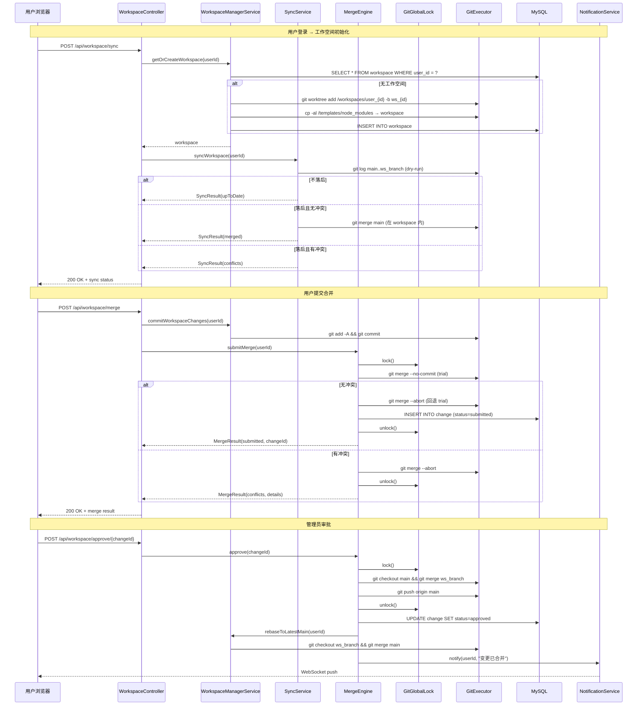

# Design Document: Workspace Isolation

## Overview

本设计实现基于 Git Worktree 的多用户工作空间隔离方案，使 NovelAppManager 平台的每个用户拥有独立的工作目录，实现操作隔离、并行构建、变更审批和冲突处理。

### 核心架构思路

```
Main Repository (main 分支) ── 唯一真相源
        │
        ├── git worktree add ──→ /workspaces/user_{userId}/  (用户A)
        ├── git worktree add ──→ /workspaces/user_{userId}/  (用户B)
        └── git worktree add ──→ /workspaces/user_{userId}/  (用户C)
        │
        └── 审批通过后 merge 回 main
```

每个用户的工作空间是一个独立的 Git Worktree，共享底层 Git 对象库，磁盘占用远小于完整副本。用户在自己的工作空间内进行所有操作（创建、编辑、构建、打包），完成后提交变更单元，经管理员审批后合并回主库。

### 关键技术决策

| 决策项 | 选择 | 理由 |
|--------|------|------|
| 隔离方案 | Git Worktree | 共享 Git 对象库，磁盘占用低，原生支持分支隔离 |
| 依赖管理 | 模板 node_modules + `cp -al` 硬链接复制 | 秒级初始化，独立构建缓存，保持 npm 不引入 pnpm |
| 构建策略 | 完全并行，不排队 | 每个工作空间有独立 node_modules 和 .vite 缓存 |
| 全局 Git 操作 | ReentrantLock 串行执行 | 单机部署，避免 Git 锁冲突 |
| 冲突处理 | 限定结构化配置文件（JSON/YAML） | 业务场景主要修改配置，非结构化文件冲突由管理员处理 |
| 基线切换 | 审批通过后自动切换 | 减少下次提交冲突概率 |
| 生命周期 | 7天超时回收 + 未提交改动保护 | 平衡资源释放与用户体验 |

## Architecture

### High-Level Architecture

```mermaid
graph TB
    subgraph Frontend["前端 (Vue3 + UniApp)"]
        WUI[Workspace UI<br/>状态栏/冲突面板/审批管理]
        WS_Client[WebSocket Client<br/>实时通知接收]
    end

    subgraph Backend["后端 (Spring Boot)"]
        subgraph Controllers
            WC[WorkspaceController<br/>/api/workspace/*]
            BC[Build/Publish Controllers<br/>现有接口改造]
        end

        subgraph Services
            WMS[WorkspaceManagerService<br/>工作空间生命周期]
            CMS[ChangeManagerService<br/>变更单元管理]
            ME[MergeEngine<br/>合并与冲突检测]
            SS[SyncService<br/>主库同步]
            CR[ConflictResolver<br/>结构化冲突解析]
            NS[NotificationService<br/>WebSocket 推送]
            TNM[TemplateNodeModulesService<br/>模板维护]
        end

        subgraph Infrastructure
            GGL[GitGlobalLock<br/>ReentrantLock]
            GE[GitExecutor<br/>Git 命令封装]
            SCH[ScheduledTasks<br/>定时回收/GC]
        end
    end

    subgraph Storage
        DB[(MySQL<br/>workspace 表 + change 表)]
        FS[文件系统]
    end

    subgraph FileSystem["文件系统布局"]
        MR[/repo<br/>Main Repository]
        TN[/templates/node_modules<br/>模板依赖]
        W1[/workspaces/user_1/<br/>用户1工作空间]
        W2[/workspaces/user_2/<br/>用户2工作空间]
    end

    WUI --> WC
    WS_Client -.->|STOMP| NS
    WC --> WMS
    WC --> CMS
    WC --> ME
    WC --> SS
    WC --> CR
    BC --> WMS
    WMS --> GE
    WMS --> TNM
    ME --> GGL
    ME --> GE
    SS --> ME
    WMS --> DB
    CMS --> DB
    SCH --> WMS
    SCH --> GGL
    GE --> FS
    TNM --> FS
```

### Low-Level Architecture: 请求处理流程



## Components and Interfaces

### 后端包结构

所有工作空间隔离相关的后端代码统一放在 `com.fun.novel.workspace` 包下，与现有的 `com.fun.novel.ai` 模块组织方式一致：

```
NovelAppManagerServer/src/main/java/com/fun/novel/workspace/
├── controller/
│   └── WorkspaceController.java
├── service/
│   ├── WorkspaceManagerService.java
│   ├── ChangeManagerService.java
│   ├── MergeEngine.java
│   ├── SyncService.java
│   ├── ConflictResolver.java
│   ├── NotificationService.java
│   └── TemplateNodeModulesService.java
├── entity/
│   ├── Workspace.java
│   ├── ChangeUnit.java
│   └── Notification.java
├── dto/
│   ├── SyncResult.java
│   ├── MergeResult.java
│   ├── MergeRequest.java
│   ├── RejectRequest.java
│   ├── ConflictDetail.java
│   ├── Resolution.java
│   ├── ResolveRequest.java
│   ├── ApproveResult.java
│   ├── NotificationPayload.java
│   └── WorkspaceStatus.java
├── enums/
│   ├── WorkspaceStatusEnum.java
│   └── ChangeStatusEnum.java
├── mapper/
│   ├── WorkspaceMapper.java
│   ├── ChangeMapper.java
│   └── NotificationMapper.java
├── config/
│   └── WorkspaceScheduledTasks.java
└── utils/
    └── GitExecutor.java
```

与现有代码的耦合点：
- 改造 `AgentBuildPublishController`（现有 controller 包）新增 userId 参数
- 复用 `com.fun.novel.utils.CommandLineExecutor` 执行 shell 命令
- 复用 `com.fun.novel.common.Result` 统一返回格式
- 复用 `com.fun.novel.websocket` 现有 WebSocket 基础设施

### 后端新增组件

#### 1. WorkspaceController

REST 控制器，处理工作空间相关的所有 HTTP 请求。

```java
@RestController
@RequestMapping("/api/workspace")
public class WorkspaceController {

    // 登录时同步工作空间（幂等）
    @PostMapping("/sync")
    Result<SyncResult> syncWorkspace(@RequestParam Long userId);

    // 提交合并请求
    @PostMapping("/merge")
    Result<MergeResult> submitMerge(@RequestParam Long userId, @RequestBody MergeRequest request);

    // 管理员审批通过
    @PostMapping("/approve/{changeId}")
    Result<ApproveResult> approve(@PathVariable String changeId);

    // 管理员拒绝
    @PostMapping("/reject/{changeId}")
    Result<Void> reject(@PathVariable String changeId, @RequestBody RejectRequest request);

    // 获取冲突列表
    @GetMapping("/conflicts/{changeId}")
    Result<List<ConflictDetail>> getConflicts(@PathVariable String changeId);

    // 解决冲突
    @PostMapping("/resolve")
    Result<Void> resolveConflict(@RequestBody ResolveRequest request);

    // 获取工作空间状态
    @GetMapping("/status")
    Result<WorkspaceStatus> getStatus(@RequestParam Long userId);

    // 获取审批队列（管理员）
    @GetMapping("/approval-queue")
    Result<List<ChangeUnit>> getApprovalQueue();

    // 销毁工作空间（运维）
    @DeleteMapping("/destroy")
    Result<Void> destroyWorkspace(@RequestParam Long userId);
}
```

#### 2. WorkspaceManagerService

工作空间全生命周期管理，核心服务。

```java
@Service
public class WorkspaceManagerService {

    // 获取或创建工作空间（按需分配）
    Workspace getOrCreateWorkspace(Long userId);

    // 创建新工作空间：worktree + cp -al
    Workspace createWorkspace(Long userId);

    // 销毁工作空间：git worktree remove
    void destroyWorkspace(Long userId);

    // 解析用户的工作空间路径
    String resolveWorkspacePath(Long userId);

    // 提交工作空间内的改动（git add + commit）
    void commitWorkspaceChanges(Long userId, String message);

    // 切换工作空间到最新主线基线
    void rebaseToLatestMain(Long userId);

    // 更新最后活跃时间
    void touchLastActiveTime(Long userId);

    // 检查工作空间是否有未提交改动
    boolean hasUncommittedChanges(Long userId);
}
```

#### 3. ChangeManagerService

变更单元的创建与状态流转。

```java
@Service
public class ChangeManagerService {

    // 创建变更单元
    ChangeUnit createChange(Long userId, String branchName);

    // 更新变更状态
    void updateStatus(String changeId, ChangeStatus newStatus);

    // 更新变更状态并记录拒绝原因
    void reject(String changeId, String reason);

    // 查询用户是否有待审批的变更
    boolean hasPendingChange(Long userId);

    // 获取审批队列
    List<ChangeUnit> getApprovalQueue();

    // 根据 changeId 查询变更详情
    ChangeUnit getById(String changeId);
}
```

#### 4. MergeEngine

合并引擎，负责全局锁控制下的合并操作。

```java
@Service
public class MergeEngine {

    private final ReentrantLock gitGlobalLock = new ReentrantLock();

    // 提交合并请求：trial merge 检测冲突
    MergeResult submitMerge(Long userId);

    // 审批通过：实际合并到 main
    ApproveResult approve(String changeId);

    // 定时 GC（凌晨执行）
    @Scheduled(cron = "0 0 3 * * ?")
    void scheduledGc();
}
```

#### 5. SyncService

工作空间与主库的同步检测与执行。

```java
@Service
public class SyncService {

    // 同步工作空间（幂等，30秒内防重复）
    SyncResult syncWorkspace(Long userId);

    // dry-run 检测是否落后
    boolean isBehindMain(String workspacePath, String branchName);

    // 执行同步合并（在工作空间内 merge main）
    SyncResult doSync(String workspacePath, String branchName);
}
```

#### 6. ConflictResolver

结构化配置文件的字段级冲突解析。

```java
@Service
public class ConflictResolver {

    // 解析冲突文件，提取字段级差异
    List<ConflictDetail> parseConflicts(String workspacePath, List<String> conflictFiles);

    // 应用用户选择的冲突解决方案
    void applyResolution(String workspacePath, List<Resolution> resolutions);

    // 判断文件是否为结构化配置文件
    boolean isStructuredConfig(String filePath);
}
```

#### 7. NotificationService

基于现有 STOMP WebSocket 的通知推送。

```java
@Service
public class NotificationService {

    // 推送通知给指定用户
    void notify(Long userId, String changeId, ChangeStatus status, String message);

    // 存储离线通知
    void storeOfflineNotification(Long userId, NotificationPayload payload);

    // 用户重连时投递离线通知
    List<NotificationPayload> deliverOfflineNotifications(Long userId);
}
```

#### 8. TemplateNodeModulesService

模板 node_modules 的维护与更新。

```java
@Service
public class TemplateNodeModulesService {

    // 重新生成模板 node_modules
    void regenerate();

    // 检查 package.json 是否有变更
    boolean isTemplateOutdated();

    // 硬链接复制到目标目录
    void copyToWorkspace(String workspacePath);
}
```

#### 9. GitExecutor

Git 命令执行的底层封装，基于现有 `CommandLineExecutor` 扩展。

```java
@Component
public class GitExecutor {

    // 创建 worktree
    void worktreeAdd(String repoPath, String workspacePath, String branchName);

    // 移除 worktree
    void worktreeRemove(String workspacePath);

    // 在指定目录执行 git 命令
    String exec(String workDir, String... gitArgs);

    // 获取 worktree 内的 status
    String status(String workspacePath);

    // trial merge（不提交）
    MergeTrialResult trialMerge(String workspacePath, String targetBranch);

    // 实际 merge
    void merge(String workspacePath, String sourceBranch);

    // abort merge
    void mergeAbort(String workspacePath);

    // fetch
    void fetch(String repoPath);

    // gc
    void gc(String repoPath);
}
```

### 前端目录结构

所有工作空间隔离相关的前端代码统一放在 `workspace/` 目录下，与现有的 `batch/`、`autoCreate/` 等模块组织方式一致：

```
NovelAppManager/src/
├── components/
│   └── workspace/                    # 工作空间组件
│       ├── WorkspaceStatusBar.vue    # 页面顶部状态栏
│       ├── ConflictResolutionPanel.vue # 冲突处理弹窗
│       └── ApprovalQueue.vue         # 审批队列（管理员）
├── views/
│   └── workspace/                    # 工作空间页面
│       └── WorkspaceApproval.vue     # 审批管理页面
├── stores/
│   └── workspaceStore.js             # 工作空间状态管理
└── services/
    └── workspaceApi.js               # 工作空间 API 封装
```

与现有代码的耦合点：
- `App.vue` 或布局组件中引入 `WorkspaceStatusBar.vue`（全局状态栏）
- `router/` 中新增审批页面路由
- 复用现有的 WebSocket 连接基础设施

### 前端新增组件

#### 1. WorkspaceStatusBar.vue

页面顶部持久化状态栏组件。

```
Props: 无（从 workspaceStore 获取状态）
Events: onSubmitMerge, onDiscard
展示: 工作空间状态 | 未提交改动指示器 | 最后操作时间 | 操作按钮
```

#### 2. ConflictResolutionPanel.vue

冲突处理弹窗面板。

```
Props: conflicts: ConflictDetail[]
Events: onResolve(resolutions), onCancel
展示: 逐字段对比（主库值 vs 用户值）+ 选择按钮
```

#### 3. ApprovalQueue.vue

管理员审批队列组件。

```
Props: 无（从 API 获取）
Events: onApprove(changeId), onReject(changeId, reason)
展示: 待审批变更列表 + 变更详情 + 审批/拒绝按钮
```

#### 4. workspaceStore.js (Pinia)

工作空间状态管理。

```javascript
// state
workspaceStatus: 'none' | 'active' | 'syncing' | 'conflict',
hasUncommittedChanges: false,
lastActiveTime: null,
currentChangeId: null,
changeStatus: null,
conflicts: [],

// actions
syncWorkspace(), submitMerge(), resolveConflict(),
getStatus(), connectWebSocket()
```

#### 5. workspaceApi.js

工作空间 API 请求封装，统一管理所有后端接口调用。

```javascript
// 工作空间管理
syncWorkspace(userId)           // POST /api/workspace/sync
getWorkspaceStatus(userId)      // GET /api/workspace/status
destroyWorkspace(userId)        // DELETE /api/workspace/destroy

// 合并与审批
submitMerge(userId, request)    // POST /api/workspace/merge
approve(changeId)               // POST /api/workspace/approve/{changeId}
reject(changeId, reason)        // POST /api/workspace/reject/{changeId}

// 冲突处理
getConflicts(changeId)          // GET /api/workspace/conflicts/{changeId}
resolveConflict(request)        // POST /api/workspace/resolve

// 审批队列
getApprovalQueue()              // GET /api/workspace/approval-queue
```

### 现有接口改造

现有的 `AgentBuildPublishController` 中的构建和发布接口需要新增 `userId` 参数：

```java
// 改造前
@PostMapping("/agent/build")
Result<String> build(@RequestBody BuildRequest request);

// 改造后
@PostMapping("/agent/build")
Result<String> build(@RequestBody BuildRequest request, @RequestParam Long userId);
// 内部通过 WorkspaceManagerService.resolveWorkspacePath(userId) 获取工作目录
```

## Data Models

### 数据库表结构

#### workspace 表

```sql
CREATE TABLE workspace (
    id              BIGINT AUTO_INCREMENT PRIMARY KEY,
    user_id         BIGINT NOT NULL COMMENT '用户ID',
    workspace_path  VARCHAR(512) NOT NULL COMMENT '工作空间文件系统路径',
    branch_name     VARCHAR(255) NOT NULL COMMENT 'Git 分支名',
    status          VARCHAR(32) NOT NULL DEFAULT 'active' COMMENT '状态: active/destroyed',
    last_active_time DATETIME NOT NULL DEFAULT CURRENT_TIMESTAMP COMMENT '最后活跃时间',
    created_at      DATETIME NOT NULL DEFAULT CURRENT_TIMESTAMP,
    updated_at      DATETIME NOT NULL DEFAULT CURRENT_TIMESTAMP ON UPDATE CURRENT_TIMESTAMP,
    UNIQUE KEY uk_user_id_active (user_id, status) COMMENT '一个用户最多一个 active 工作空间'
) ENGINE=InnoDB DEFAULT CHARSET=utf8mb4 COMMENT='工作空间表';
```

#### change 表

```sql
CREATE TABLE `change` (
    id              BIGINT AUTO_INCREMENT PRIMARY KEY,
    change_id       VARCHAR(64) NOT NULL COMMENT '变更单元唯一标识',
    user_id         BIGINT NOT NULL COMMENT '用户ID',
    branch_name     VARCHAR(255) NOT NULL COMMENT '变更所在分支',
    status          VARCHAR(32) NOT NULL DEFAULT 'editing' COMMENT '状态: editing/submitted/approved/rejected',
    submitted_at    DATETIME DEFAULT NULL COMMENT '提交时间',
    approved_at     DATETIME DEFAULT NULL COMMENT '审批通过时间',
    reject_reason   VARCHAR(1024) DEFAULT NULL COMMENT '拒绝原因',
    created_at      DATETIME NOT NULL DEFAULT CURRENT_TIMESTAMP,
    updated_at      DATETIME NOT NULL DEFAULT CURRENT_TIMESTAMP ON UPDATE CURRENT_TIMESTAMP,
    UNIQUE KEY uk_change_id (change_id),
    INDEX idx_user_id (user_id),
    INDEX idx_status (status)
) ENGINE=InnoDB DEFAULT CHARSET=utf8mb4 COMMENT='变更单元表';
```

#### notification 表（离线通知存储）

```sql
CREATE TABLE notification (
    id              BIGINT AUTO_INCREMENT PRIMARY KEY,
    user_id         BIGINT NOT NULL COMMENT '目标用户ID',
    change_id       VARCHAR(64) DEFAULT NULL COMMENT '关联变更ID',
    status          VARCHAR(32) NOT NULL COMMENT '通知类型: approved/rejected/conflict/sync',
    message         VARCHAR(1024) NOT NULL COMMENT '通知内容',
    delivered       TINYINT(1) NOT NULL DEFAULT 0 COMMENT '是否已投递',
    created_at      DATETIME NOT NULL DEFAULT CURRENT_TIMESTAMP,
    INDEX idx_user_delivered (user_id, delivered)
) ENGINE=InnoDB DEFAULT CHARSET=utf8mb4 COMMENT='通知表';
```

### Java Entity 定义

#### Workspace Entity

```java
@Data
@TableName("workspace")
public class Workspace {
    @TableId(type = IdType.AUTO)
    private Long id;
    private Long userId;
    private String workspacePath;
    private String branchName;
    private String status;          // active, destroyed
    private LocalDateTime lastActiveTime;
    private LocalDateTime createdAt;
    private LocalDateTime updatedAt;
}
```

#### ChangeUnit Entity

```java
@Data
@TableName("change")
public class ChangeUnit {
    @TableId(type = IdType.AUTO)
    private Long id;
    private String changeId;
    private Long userId;
    private String branchName;
    private String status;          // editing, submitted, approved, rejected
    private LocalDateTime submittedAt;
    private LocalDateTime approvedAt;
    private String rejectReason;
    private LocalDateTime createdAt;
    private LocalDateTime updatedAt;
}
```

### DTO 定义

```java
// 同步结果
@Data
public class SyncResult {
    private String status;          // up_to_date, merged, conflicts
    private List<ConflictDetail> conflicts;
}

// 合并结果
@Data
public class MergeResult {
    private String status;          // submitted, conflicts
    private String changeId;
    private List<ConflictDetail> conflicts;
}

// 冲突详情
@Data
public class ConflictDetail {
    private String filePath;
    private String fieldPath;       // JSON/YAML 字段路径，如 "config.theme.backgroundColor"
    private String mainValue;       // 主库当前值
    private String userValue;       // 用户修改值
}

// 冲突解决请求
@Data
public class ResolveRequest {
    private String changeId;
    private List<Resolution> resolutions;
}

@Data
public class Resolution {
    private String filePath;
    private String fieldPath;
    private boolean useMain;        // true=使用主库值, false=保留用户值
}

// 审批结果
@Data
public class ApproveResult {
    private String changeId;
    private String status;          // approved, merge_failed
    private String message;
}

// WebSocket 通知载荷
@Data
public class NotificationPayload {
    private String changeId;
    private String status;
    private String message;
    private LocalDateTime timestamp;
}

// 工作空间状态
@Data
public class WorkspaceStatus {
    private String status;          // none, active, syncing, conflict
    private boolean hasUncommittedChanges;
    private LocalDateTime lastActiveTime;
    private String currentChangeId;
    private String changeStatus;
}
```

### 文件系统布局

```
/                                   # 服务器根目录
├── repo/                           # 主 Git 仓库（Main Repository）
│   ├── .git/
│   │   └── worktrees/              # Git Worktree 元数据
│   │       ├── ws_1/
│   │       └── ws_2/
│   ├── src/
│   ├── package.json
│   └── package-lock.json
│
├── templates/
│   ├── node_modules/               # 预装好的模板依赖
│   ├── package.json                # 与主库同步
│   └── package-lock.json
│
└── workspaces/
    ├── user_1/                     # 用户1的工作空间（Worktree）
    │   ├── src/
    │   ├── package.json
    │   ├── node_modules/           # 硬链接复制自模板
    │   └── dist/                   # 构建产物（独立）
    └── user_2/                     # 用户2的工作空间
        └── ...
```

## Correctness Properties

*A property is a characteristic or behavior that should hold true across all valid executions of a system — essentially, a formal statement about what the system should do. Properties serve as the bridge between human-readable specifications and machine-verifiable correctness guarantees.*

### Property 1: Workspace reuse idempotency

*For any* user who already has an active workspace, calling `getOrCreateWorkspace` any number of times should always return the same workspace (same path, same branch) without creating additional worktrees.

**Validates: Requirements 2.1**

### Property 2: Sync endpoint idempotency

*For any* user, multiple sync requests within a 30-second window should result in only the first request executing the actual sync operation; subsequent requests should return an "already in progress" result without triggering duplicate merges.

**Validates: Requirements 3.5**

### Property 3: Workspace path resolution correctness

*For any* user with an active workspace, `resolveWorkspacePath(userId)` should return a path that exactly matches the `workspace_path` field stored in the database for that user's active workspace record.

**Validates: Requirements 4.2**

### Property 4: Change ID uniqueness

*For any* sequence of change unit creations (regardless of user or timing), all generated `change_id` values should be globally unique — no two ChangeUnit records should share the same `change_id`.

**Validates: Requirements 5.1**

### Property 5: Change status transition enforcement

*For any* ChangeUnit in a given status, only the valid next statuses should be accepted: `editing` → `submitted`, `submitted` → `approved` or `rejected`. All other transitions (e.g., `editing` → `approved`, `rejected` → `submitted`) should be rejected with an error.

**Validates: Requirements 5.3**

### Property 6: Duplicate submission rejection

*For any* user who already has a ChangeUnit in `submitted` status, attempting to create a new submission should be rejected, and the existing submitted ChangeUnit should remain unchanged.

**Validates: Requirements 5.4**

### Property 7: Structured config conflict field extraction

*For any* two versions of a JSON or YAML configuration file with known field-level differences, `parseConflicts` should identify all and only the differing fields, returning the correct main value and user value for each conflicting field path.

**Validates: Requirements 6.4, 7.1**

### Property 8: Structured file type classification

*For any* file path, `isStructuredConfig` should return `true` if and only if the file extension is `.json`, `.yaml`, or `.yml`. All other extensions should return `false`.

**Validates: Requirements 6.5**

### Property 9: Conflict resolution application

*For any* set of conflict resolutions applied to a structured config file, each field should contain the value selected by the user: the main repository value when `useMain=true`, or the user's value when `useMain=false`. Fields not in the conflict set should remain unchanged.

**Validates: Requirements 7.2**

### Property 10: Approval queue filtering

*For any* set of ChangeUnit records with various statuses (`editing`, `submitted`, `approved`, `rejected`), `getApprovalQueue` should return exactly those ChangeUnits with `status=submitted`, and no others.

**Validates: Requirements 8.1**

### Property 11: Reclamation query correctness

*For any* set of workspace records with various `last_active_time` values, the reclamation scheduled task should identify exactly those workspaces where `last_active_time` is older than 7 days from the current time, and no others.

**Validates: Requirements 9.2**

### Property 12: Offline notification delivery completeness

*For any* set of notifications created while a user's WebSocket connection is inactive, `deliverOfflineNotifications` should return all undelivered notifications for that user, and after delivery, those notifications should be marked as delivered and not returned again.

**Validates: Requirements 12.2**

### Property 13: Entity data integrity

*For any* persisted Workspace entity, the fields `user_id`, `workspace_path`, `branch_name`, `status`, `last_active_time`, `created_at`, and `updated_at` should all be non-null. *For any* persisted ChangeUnit entity, the fields `change_id`, `user_id`, `branch_name`, and `status` should all be non-null.

**Validates: Requirements 5.2, 14.1, 14.2**

### Property 14: One user one active workspace invariant

*For any* user, the number of workspace records with `status=active` should always be at most 1, regardless of how many concurrent creation attempts are made.

**Validates: Requirements 14.3**

### Property 15: Path stability during baseline switch

*For any* baseline switch operation triggered by change approval, the `workspace_path` in the database before and after the switch should be identical — only the underlying Git branch reference changes, not the filesystem path.

**Validates: Requirements 15.2**

### Property 16: Notification payload completeness

*For any* NotificationPayload sent via WebSocket, the fields `change_id`, `status`, and `message` should all be non-null and non-empty.

**Validates: Requirements 12.3**

## Error Handling

### 错误分类与处理策略

| 错误类型 | 场景 | 处理策略 | 用户感知 |
|----------|------|----------|----------|
| Git 命令失败 | worktree add/remove 失败 | 日志记录 + 返回描述性错误 | 提示"工作空间创建失败，请重试" |
| 硬链接复制失败 | cp -al 失败（磁盘满等） | 清理半成品 worktree + 返回错误 | 提示"工作空间初始化失败" |
| 合并冲突 | 结构化文件冲突 | abort merge + 返回字段级冲突详情 | 展示冲突面板让用户选择 |
| 合并冲突 | 非结构化文件冲突 | abort merge + 提示联系管理员 | 提示"请联系管理员处理" |
| 全局锁超时 | 长时间等待锁 | 设置锁等待超时（30秒） | 提示"系统繁忙，请稍后重试" |
| 审批合并失败 | approve 时 merge 失败 | 回滚 change 状态 | 管理员看到错误提示 |
| 基线切换失败 | rebase 失败 | 日志记录，下次登录时 sync 修复 | 用户无感知 |
| WebSocket 断连 | 通知推送时连接不可用 | 存储离线通知，重连时投递 | 重连后收到通知 |
| 工作空间不存在 | API 调用时 workspace 已被回收 | 自动创建新工作空间 | 用户无感知（透明重建） |

### 事务与补偿机制

审批流程涉及多个步骤（数据库更新 + Git 操作 + 通知），采用以下策略保证一致性：

```
步骤1: 数据库更新 change 状态 → approved     ← @Transactional 保护
步骤2: Git merge 到 main                     ← 失败则事务回滚
步骤3: 工作空间切换基线                        ← 失败不影响主库，下次 sync 修复
步骤4: WebSocket 通知                         ← 失败不影响数据，存储离线通知
```

关键原则：
- 步骤1和2在同一事务中，要么都成功要么都回滚
- 步骤3失败是可恢复的（下次登录时 sync 自动修复）
- 步骤4失败是可容忍的（离线通知兜底）

### 全局锁超时保护

```java
boolean acquired = gitGlobalLock.tryLock(30, TimeUnit.SECONDS);
if (!acquired) {
    throw new ServiceException("系统繁忙，请稍后重试");
}
```

## Testing Strategy

### 测试框架选择

- **后端单元测试**: JUnit 5 + Mockito
- **后端属性测试**: jqwik（Java 属性测试库）
- **后端集成测试**: Spring Boot Test + H2 内存数据库
- **前端单元测试**: Vitest + Vue Test Utils
- **前端 E2E 测试**: 手动测试（当前项目无 E2E 框架）

### 属性测试（Property-Based Testing）

本功能包含多个适合属性测试的纯逻辑组件，使用 jqwik 库实现。每个属性测试至少运行 100 次迭代。

**适合属性测试的组件：**

1. **ChangeManagerService 状态机** — 状态转换规则是纯逻辑，输入空间大（任意状态 × 任意目标状态）
2. **ConflictResolver 冲突解析** — JSON/YAML 差异提取是纯函数，输入空间大（任意 JSON 结构）
3. **ConflictResolver 冲突应用** — 解决方案应用是纯函数
4. **文件类型分类** — 纯函数，输入空间大（任意文件路径）
5. **审批队列过滤** — 纯查询逻辑
6. **回收查询** — 纯查询逻辑
7. **通知载荷完整性** — 数据构造验证

**属性测试标签格式：**
```java
// Feature: workspace-isolation, Property 5: Change status transition enforcement
@Property(tries = 100)
void statusTransitionEnforcement(@ForAll ChangeStatus from, @ForAll ChangeStatus to) { ... }
```

### 单元测试

覆盖以下场景：
- 工作空间创建失败时的清理逻辑
- 工作空间复用时的 last_active_time 更新
- Sync dry-run 的三种结果分支
- 合并请求的冲突/无冲突分支
- 审批通过/拒绝/失败的三种路径
- 回收时有/无未提交改动的两种路径
- 离线通知的存储与投递

### 集成测试

覆盖以下场景：
- 完整的工作空间创建流程（worktree + cp -al + 数据库记录）
- 完整的合并审批流程（提交 → 审批 → 合并 → 基线切换）
- 并发构建不互相干扰
- 全局锁串行化验证
- WebSocket 通知端到端投递
