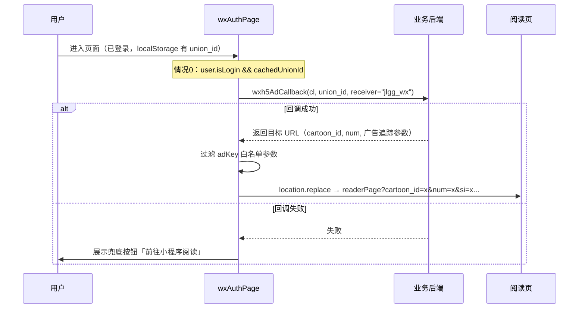
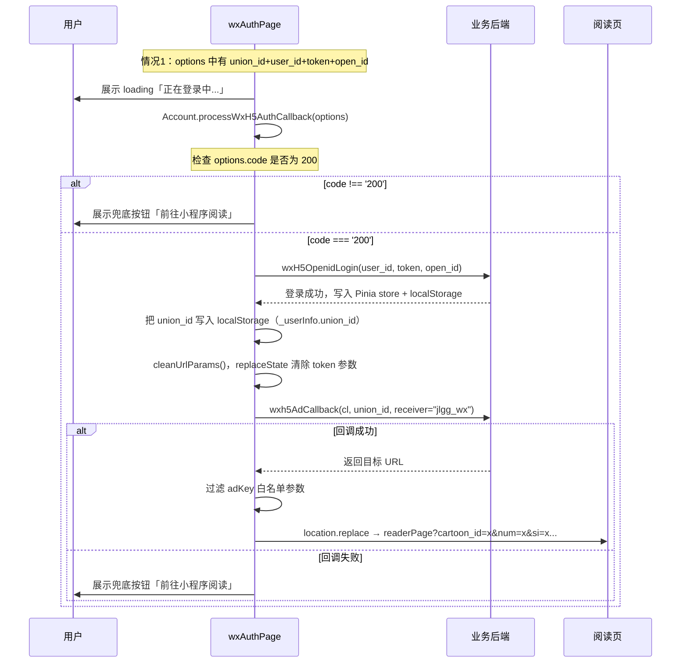
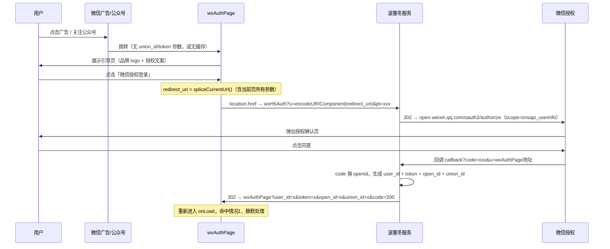
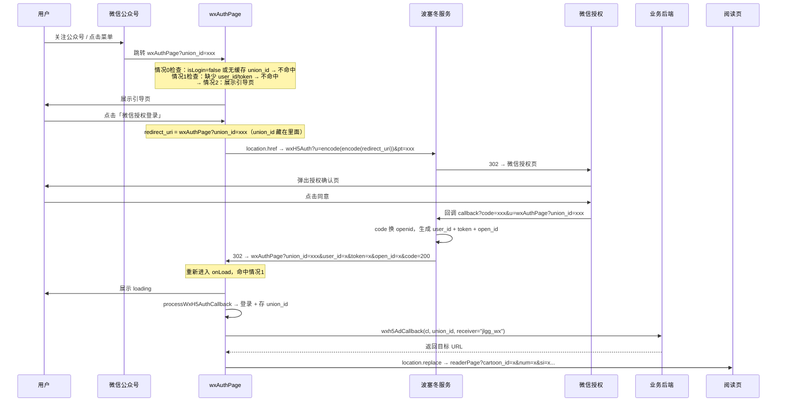

# wxAuthPage 业务时序图

## 页面职责

`wxAuthPage` 是微信 H5 广告投放的授权中间页，承担两个角色：

1. **引导页**：用户首次进入（无授权参数且无缓存），展示品牌引导 UI，等待用户手动触发微信授权
2. **静默回调页**：微信四跳授权完成后带参数回调，或本地已有缓存，静默完成登录 + 拉取广告参数 + 跳转阅读页

---

## onLoad 判断逻辑

```
onLoad(options)
  ├── 情况0：user.isLogin && user.userInfo.union_id 有缓存
  │     → 直接用缓存 union_id 查接口跳阅读页（跳过授权）
  │
  ├── 情况1：options 中有 union_id + user_id + token + open_id（四跳回调）
  │     → 静默登录 + 存 union_id + 查接口跳阅读页
  │
  └── 情况2：以上都不满足
        → 展示授权引导页，等待用户点击授权
```

---

## 情况0：有缓存直接跳



---

## 情况1：四跳授权回调（静默处理）



---

## 情况2：首次进入，无缓存，需授权



---

## 公众号进来带 union_id 的完整链路



### union_id 透传机制

`union_id` 天然藏在 `redirect_uri` 里随四跳流程透传：

```
第1跳：wxAuthPage?union_id=xxx
  → 作为 redirect_uri 双重编码传给波塞冬

第2跳：波塞冬 → 微信授权
  → redirect_uri 中保留了 u=wxAuthPage?union_id=xxx

第3跳：微信 → 波塞冬 callback
  → 波塞冬解码拿到原始 redirect_uri（含 union_id）

第4跳：波塞冬 → wxAuthPage?union_id=xxx&user_id=x&token=x&open_id=x&code=200
  → union_id 原样拼回，四个参数齐全
```

---

## 关键参数说明

| 参数 | 来源 | 说明 |
|------|------|------|
| `union_id` | 波塞冬回调 / 公众号链接 | 微信公众号 union_id，用于查广告回调参数，授权成功后持久化到 localStorage |
| `user_id` / `token` / `open_id` | 波塞冬回调 | 登录凭证，写入后立即用 `replaceState` 从 URL 清除 |
| `code` | 波塞冬回调 | 授权结果码，`200` 表示成功，非 200 直接展示兜底 |
| `cl` | AppConfig | `_h5_` 替换为 `_miniapp_`，对应小程序侧广告渠道标识 |
| `receiver` | 固定值 | `"jlgg_wx"`，标识来源为微信公众号关注链路 |

---

## 广告参数白名单（adKey.keys）

回调接口返回的 URL 参数经过白名单过滤，只保留以下字段传入阅读页：

`coopCode`, `ctime`, `microapp_id`, `popularizeId`, `si`, `clickid`, `callback`, `clue_token`, `bd_vid`, `promotion_ad_id`, `promotion_thirdad_id`, `promotion_code`, `cartoon_id`, `promotion_id`, `promotionid`, `promotion_pt`, `adid`, `gdt_vid`, `qz_gdt`, `third_account_id`, `third_set_id`, `third_maccount_id`, `num`

---

## 相关文件

| 文件 | 职责 |
|------|------|
| `src/pages/wxAuthPage/wxAuthPage.vue` | 页面主逻辑（情况0/1/2 判断、fetchAndJumpToReaderPage） |
| `src/modules/mod_account/Account.js` | `processWxH5AuthCallback`（登录+上报+清URL+存union_id）、`wxH5LoginRedirectTo` |
| `src/hooks/useUser.js` | `wxH5LoginRedirectTo` 参数组装 |
| `src/modules/mod_user/host/wxh5.js` | 微信 H5 登录处理器 |
| `src/modules/mod_mount/resolver/adKey.js` | 广告参数白名单定义 |
| `src/store/user.js` | Pinia 用户状态管理，`updateUserInfo` action，持久化到 localStorage |
| `src/appConfig/localConfigs/base.js` | `wxh5AdCallback` 接口地址配置 |
